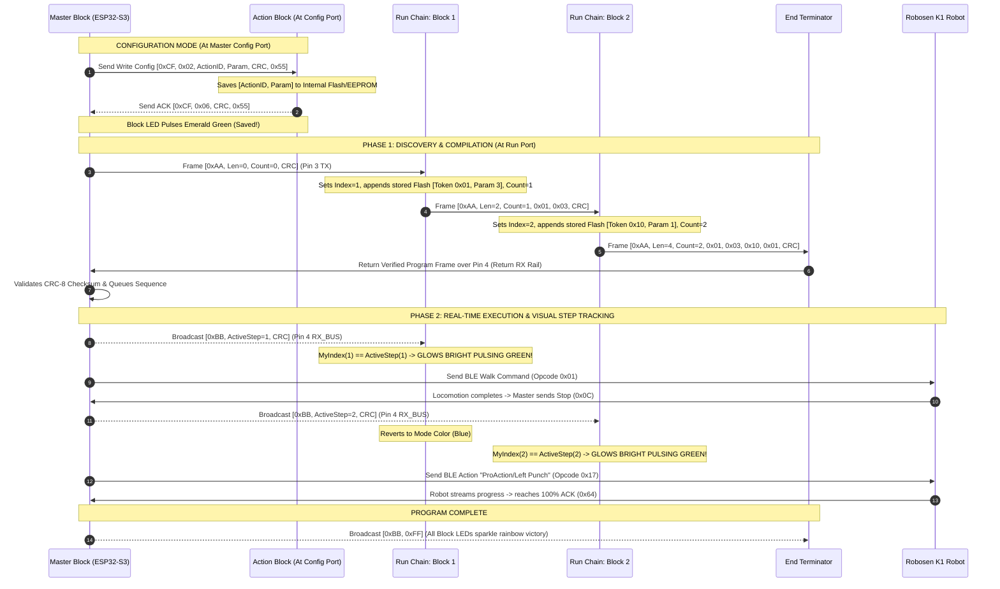

# Tangible Modular Coding Block System for Robosen Robot Control

> **Document Version:** 3.0  
> **Target Hardware:** Physical Modular Programming Blocks (ESP32-S3 Master with E-Ink & Config Dock + CH32V003 Slaves) $\longleftrightarrow$ Robosen K1 Humanoid Robot (Bluetooth Low Energy)

---

## 1. System Overview

This project is a **tangible / physical block-based programming system** designed to teach computational thinking and robotics to young children ($\le 7$ years old) without screens, tablets, or computers.

Users configure solid, durable code blocks at the **Master Block Config Port**, then snap them together in a linear sequence at the **Run Port** to build a robot program.

```
┌────────────────────────────────────────────────────────────────────────────────────────────────────────┐
│                                       PHYSICAL HARDWARE SYSTEM                                         │
│                                                                                                        │
│   ┌────────────────────────────────── MASTER CONTROLLER BLOCK ─────────────────────────────────────┐   │
│   │                                                                                                │   │
│   │   ┌───────────────────────────┐    ┌─────────────────┐    ┌────────────────────────┐           │   │
│   │   │       E-INK DISPLAY       │    │  KNOB 1 (Action)│    │  KNOB 2 (Parameter)    │           │   │
│   │   │  [ Walk Forward | 3 Steps]│    │  [Rotary Dial]  │    │  [Rotary Dial]         │           │   │
│   │   └───────────────────────────┘    └─────────────────┘    └────────────────────────┘           │   │
│   │                                                                                                │   │
│   │   [ START BUTTON ]   [ RGB STATUS ]   [ TP4056 USB-C LiPo ]   [ ESP32-S3 (BLE + SPI + Dual UART) ]│   │
│   │                                                                                                │   │
│   │        ┌─────────────────────────────┐        ┌─────────────────────────────┐                  │   │
│   │        │      1. CONFIG PORT         │        │        2. RUN PORT          │                  │   │
│   │        │  (4-Pin Magnetic Dock)      │        │  (4-Pin Daisy-Chain Start)  │                  │   │
│   │        └──────────────┬──────────────┘        └──────────────┬──────────────┘                  │   │
│   └───────────────────────┼──────────────────────────────────────┼─────────────────────────────────┘   │
│                           │                                      │                                     │
│                 (Dock 1 Block to Flash)             (Snap Full Sequence to Run)                        │
│                           │                                      │                                     │
│                           ▼                                      ▼                                     │
│                ┌─────────────────────┐             ┌───────────┐   ┌───────────┐   ┌─────────┐         │
│                │ SINGLE ACTION BLOCK │             │  BLOCK 1  │──►│  BLOCK 2  │──►│ END     │         │
│                │  - CH32V003 ($0.15) │             │ (CH32V003)│   │ (CH32V003)│   │(Loopback│         │
│                │  - WS2812B RGB LED  │             └─────┬─────┘   └─────┬─────┘   └────┬────┘         │
│                │  - NO BUTTONS/KNOBS!│                   │               │              │              │
│                └─────────────────────┘                   └───────────────┴──────────────┘              │
│                                                                          │                             │
│                                                               Pin 4 (Return RX & Broadcast Bus)        │
│                                                                          │                             │
│                                                                          ▼                             │
│                                                          [ MASTER ESP32-S3 BLE ENGINE ]                │
│                                                                          │                             │
│                                                                          ▼ (Bluetooth Low Energy)      │
│                                                                [ ROBOSEN K1 ROBOT ]                    │
└────────────────────────────────────────────────────────────────────────────────────────────────────────┘
```

---

## 2. Block Hardware Specifications

### Block 1: Master Controller Block (The Brain, Config Dock & BLE Gateway)
The Master Block serves as the central control unit, battery power supply, block programming dock, and wireless robot bridge.

- **Onboard Components**:
  1. **Microcontroller**: **ESP32-S3** (Dual-core Xtensa LX7, Native Bluetooth 5.0 BLE Central, Hardware SPI for E-Ink, dual hardware UARTs for Config and Run ports).
  2. **E-Ink Display**: 1.54" or 2.13" Ultra-Low-Power E-Paper display (SPI interface) with fast partial refresh support (~0.3s) displaying selected action names, child-friendly icons, and parameter values.
  3. **Dual Rotary Knobs**:
     - **Knob 1 (Action Selector)**: Rotates to choose the robot action (Walk, Turn, Punch, Kick, Kung Fu, Dance, Delay, Loop).
     - **Knob 2 (Parameter Selector)**: Rotates to choose the parameter modifier (Steps: 1–10, Angles: 45°–180°, Repetitions: 1–5, Seconds: 1–5s).
  4. **Start / Go Button**: Large tactile push button to trigger sequence compilation and execution.
  5. **Config Port (4-Pin Magnetic Dock)**: Dedicated programming dock where a single block is placed to write action & parameter settings into its non-volatile Flash/EEPROM memory.
  6. **Run Port (4-Pin Magnetic Socket)**: Starting interface for the execution chain where modular blocks snap together.
  7. **Visual Feedback (No Buzzer)**: Integrated WS2812B RGB Status LED around the Start button / Ports providing rich lighting choreography (no classroom audio noise).
  8. **Power & Battery Subsystem**: Single-cell 3.7V LiPo / 18650 battery (1500–2200 mAh) with onboard TP4056 USB-C charging circuit, battery protection IC (BMS), and high-efficiency synchronous 3.3V buck-boost regulator delivering power to `Pin 1 (V+)`.

---

### Block 2: Solid Smart Action Blocks (Modular Code Modules)
Every action block is an ultra-durable, solid plastic module with **zero moving parts** (no potentiometers or push-buttons on individual blocks):

- **Onboard Components**:
  1. **Microcontroller**: Ultra-low-cost **WCH CH32V003** (32-bit RISC-V in SOP-8 package, ~$0.15).
  2. **Memory**: Uses CH32V003 internal Non-Volatile Flash / EEPROM emulation (192 bytes) to store its assigned Action Token ID and Parameter Byte permanently across power cycles.
  3. **Visual Feedback**: Top-mounted **WS2812B RGB LED** displaying action mode colors, parameter flash previews, and bright pulsating green during execution.
  4. **Upstream 4-Pin Pogo Connector (Pin In)**: Receives `V+ (3.3V)`, `GND`, upstream `UART TX`, and passes through `Return RX`.
  5. **Downstream 4-Pin Pogo Connector (Pin Out)**: Transmits `V+ (3.3V)`, `GND`, downstream `UART TX`, and passes through `Return RX`.

---

### Block 3: End Terminator Block (Sequence Completion Module)
The End Block marks the physical end of the user's code sequence.

- **Variants**:
  1. **Passive End Block**: Contains an internal PCB trace bridging **Pin 3 (`UART TX_DOWN`) directly to Pin 4 (`UART RX_BUS`)**.
  2. **Smart End Block**: Contains a CH32V003 MCU that senses end-of-chain termination, verifies CRC-8, displays a green status LED, and loops data back to the Return RX rail.

---

## 3. Standardized 4-Pin Magnetic Pogo Connector Pinout

Both the **Config Port** and the **Run Port** (as well as all Action Blocks) share an identical 4-pin magnetic interface:

| Pin # | Signal Name | Type | Purpose in Config Port | Purpose in Run Chain |
| :---: | :--- | :---: | :--- | :--- |
| **Pin 1** | **`V+` (3.3V)** | Power | Powers single docked block | Regulated 3.3V power rail for entire chain |
| **Pin 2** | **`GND`** | Power | System ground | Common system ground |
| **Pin 3** | **`UART TX_DOWN`** | Data Out | Config Command line (Master $\to$ Block) | Cascading downstream line (Master $\to$ B1 $\to$ B2 $\dots$) |
| **Pin 4** | **`UART RX_BUS`** | Data In / Bus | Config Response / ACK line (Block $\to$ Master) | Continuous return rail & live step broadcast bus |

```text
                ┌────────────────────────────────┐
                │ 4-PIN POGO PIN CONNECTOR       │
                │                                │
                │  (1) [ V+ 3.3V ] (Power)       │
                │  (2) [ GND ]     (Ground)      │
                │  (3) [ TX_DOWN ] (Downstream)  │
                │  (4) [ RX_BUS ]  (Return Rail) │
                └────────────────────────────────┘
```

---

## 4. Multi-Phase Communication Protocol

Serial communications operate at 9600 / 115200 baud with binary framing protected by **CRC-8** (Polynomial: $x^8 + x^2 + x + 1$, `0x07`).



---

### 4.1 Configuration Port Protocol (`Header = 0xCF`)
Used exclusively when a single block is docked on the **Config Port**:

1. **Read Current Config (`Subcommand = 0x01`)**:
   - Master sends: `[0xCF, 0x01, CRC, 0x55]`
   - Block replies: `[0xCF, 0x81, ActionID, ParamVal, CRC, 0x55]`
   - Master updates E-Ink display and Knobs to reflect the block's current saved state.
2. **Write New Config (`Subcommand = 0x02`)**:
   - Master sends: `[0xCF, 0x02, ActionID, ParamVal, CRC, 0x55]`
   - Block writes `[ActionID, ParamVal]` to internal non-volatile flash.
   - Block replies: `[0xCF, 0x06 (ACK), CRC, 0x55]`.
   - Block's WS2812B LED performs an **Emerald Green Success Pulse**.

---

### 4.2 Phase 1: Discovery & Program Compilation (`Header = 0xAA`)
Transmitted downstream from the Master Run Port through the connected chain:
```text
+-------------+------------+-------------+-----------+-------------+-----------+-------------+--------+-------------+
| HEADER      | PACKET LEN | BLOCK COUNT | BLOCK 1   | PARAMETER 1 | BLOCK 2   | PARAMETER 2 | CRC-8  | FOOTER      |
| 1 Byte: 0xAA| 1 Byte (N) | 1 Byte (K)  | 1 Byte ID | 1 Byte Val  | 1 Byte ID | 1 Byte Val  | 1 Byte | 1 Byte: 0x55|
+-------------+------------+-------------+-----------+-------------+-----------+-------------+--------+-------------+
```

---

### 4.3 Phase 2: Live Step Execution Broadcast (`Header = 0xBB`)
Broadcast across Pin 4 during robot movement to coordinate active LED illumination:
```text
+-------------+-------------+-------------+--------+-------------+
| HEADER      | ACTIVE STEP | TOTAL STEPS | CRC-8  | FOOTER      |
| 1 Byte: 0xBB| 1 Byte (1-N)| 1 Byte (N)  | 1 Byte | 1 Byte: 0x55|
+-------------+-------------+-------------+--------+-------------+
```
- `ACTIVE STEP = 0x00`: Standby / Idle (all blocks show their configured action color).
- `ACTIVE STEP = 0x01..0xFE`: The specific block matching `ACTIVE STEP` turns **bright pulsating green (100% brightness)**.
- `ACTIVE STEP = 0xFF`: Program Complete (all blocks trigger celebratory rainbow ripple).

---

## 5. Visual "Light Language" Choreography (No Buzzer)

To eliminate disruptive audio beeping in busy classroom environments, the system communicates entirely through **expressive WS2812B RGB light choreography** and the **high-contrast E-Ink display**:

| Event / State | Master Status LED | Target Block LED | Visual Indication |
| :--- | :--- | :--- | :--- |
| **Block Docked (Config Port)** | Soft cyan glow | Gentle cyan fade-in pulse | *"Block connected & recognized"* |
| **Action Changed (Knob 1)** | Matches action color | Morphs instantly to Action Color | *"Action mode selected"* |
| **Param Changed (Knob 2)** | E-Ink text updates | Flashes $N$ times (e.g. 3 blinks = 3 steps) | *"Parameter preview"* |
| **Config Saved to Flash** | Single green flash | **Emerald Green "Success Pulse"** | *"Saved to permanent memory"* |
| **Compile & Start (Phase 1)** | Bright white pulse | **"Data Comet Wave":** Fast light pulse sweeps Block 1 $\to$ Block 2 $\to$ End | *"Program compiled & verified"* |
| **Active Execution (Phase 2)**| Calm solid green | **Bright pulsating green** on active step; other blocks stay dim (20%) | *"Robot currently running this block"* |
| **Program Complete** | Rainbow ripple | **Synchronized Rainbow Sparkle** across full chain | *"Sequence finished successfully!"* |
| **Error / Broken Loop** | 2 rapid red flashes | 2 rapid red flashes on disconnected block | *"Loose magnetic contact / check chain"* |

---

## 6. Action Token Catalog & Color Mapping

| Token ID | Command Name | Parameter (Knob 2) | Robosen BLE Opcode / Frame | LED Mode Color |
| :---: | :--- | :--- | :--- | :---: |
| `0x01` | `MOVE_FORWARD` | Steps (`1`–`10`) | `0x01` (`ffff020103` + Stop) | 🔵 Blue (`#1E88E5`) |
| `0x02` | `MOVE_BACKWARD`| Steps (`1`–`10`) | `0x05` (`ffff020507` + Stop) | 🔵 Dark Blue (`#1565C0`) |
| `0x03` | `TURN_LEFT` | Angle (`45°`, `90°`, `135°`, `180°`) | `0x08` (`ffff02080a` + Stop) | 🔷 Cyan (`#00ACC1`) |
| `0x04` | `TURN_RIGHT` | Angle (`45°`, `90°`, `135°`, `180°`) | `0x02` (`ffff020204` + Stop) | 🔷 Cyan (`#00ACC1`) |
| `0x07` | `MOVE_LEFT` | Side-steps (`1`–`5`) | `0x07` (`ffff020709` + Stop) | 🟦 Sky Blue (`#039BE5`) |
| `0x08` | `MOVE_RIGHT` | Side-steps (`1`–`5`) | `0x03` (`ffff020305` + Stop) | 🟦 Sky Blue (`#039BE5`) |
| `0x10` | `LEFT_PUNCH` | Style (`1`–`3`) | `0x17` (`"ProAction/Left Punch"`) | 🔴 Red (`#E53935`) |
| `0x11` | `RIGHT_PUNCH`| Style (`1`–`3`) | `0x17` (`"ProAction/Right Punch"`) | 🔴 Bright Red (`#D32F2F`) |
| `0x12` | `KUNG_FU` | Routine (`1`–`3`) | `0x17` (`"ProAction/Kung Fu"`) | 🟠 Orange (`#FB8C00`) |
| `0x13` | `DANCE_BOOGALOO`| Track (`1`–`2`) | `0x17` (`"Action/Boogaloo"`) | 🟣 Magenta (`#8E24AA`) |
| `0x14` | `PUSH_UPS` | Reps (`1`–`3`) | `0x17` (`"ProAction/Push Ups"`) | 🟤 Brown (`#6D4C41`) |
| `0x15` | `HANDSTAND` | Duration (`1`–`3`) | `0x17` (`"ProAction/Handstand"`) | 🟤 Brown (`#6D4C41`) |
| `0x20` | `HEAD_MOVE` | Angle (`42`–`202`) | `0xE8` (Servo index 16) | 🩵 Teal (`#00897B`) |
| `0x30` | `WAIT_DELAY` | Seconds (`1`–`5`s) | Master internal sleep timer | 🟡 Yellow (`#FBC02D`) |
| `0x40` | `REPEAT_LOOP`| Iterations (`2x`–`5x`)| Master queue sub-loop | 🟢 Lime (`#7CB342`) |

---

## 7. Action Block CH32V003 SOP-8 Pinout

Because knobs and buttons are eliminated from the action blocks, the **CH32V003 (SOP-8)** pin configuration is minimal, robust, and cost-effective:

```text
                  CH32V003 (SOP-8 Package)
                        +-------------+
        (V+ 3.3V)    ---| 1 VDD 8 GND |----  (GND)
         (Unused)    ---| 2 PA1 7 PC4 |----  (Unused / Test Pad)
    (WS2812B LED)    ---| 3 PA2 6 PD6 |----  (UART RX - Pin 3 In)
    (SWIO / NRST)    ---| 4 PD1 5 PD5 |----  (UART TX - Pin 3 Out)
                        +-------------+
```

---

## 8. Multi-Robot Classroom Deployment & Smart NVS BLE Pairing

In classroom environments with 5–10 student groups operating simultaneously, each Master Block is locked to its own designated Robosen K1 robot to prevent BLE crosstalk and command collisions.

```text
┌────────────────────────────────────────────────────────────────────────────────────────┐
│                              SMART NVS BLE PAIRING LIFECYCLE                           │
│                                                                                        │
│  [ Boot-Up ] ──► [ Read Target MAC from NVS ] ──► [ Direct Connect (<500ms) ] ──► [ Ready ]
│                          │
│                          ▼ (If Start/Knob held for 3 seconds)
│                  [ E-Ink Pairing Menu ] 
│                  - Scans nearby "K1-*" devices
│                  - Sorts by RSSI Proximity (Nearest first)
│                  - Turn Knob 1 to select -> Click to save
│                  - Writes new MAC to NVS as persistent default
└────────────────────────────────────────────────────────────────────────────────────────┘
```

### 8.1 3-Tier Multi-Robot Architecture
1. **Persistent Default (Direct Instant Boot):**
   - The ESP32-S3 stores `last_paired_mac` and `last_paired_name` in its internal Non-Volatile Storage (NVS flash partition).
   - On power-up, the Master bypasses BLE broadcast scanning and connects directly to the stored MAC in $<500\,\text{ms}$.
2. **E-Ink Teacher Pairing Menu (Hot-Swap / Re-Binding):**
   - If a robot battery runs low or is swapped with a spare unit:
     1. The teacher/student holds the **Start Button (or Knob Click) for 3 seconds**.
     2. The Master enters **BLE Scan Mode** and displays a live list on the **E-Ink Screen**:
        ```text
        ┌─────────────────────────────┐
        │     PAIR ROBOSEN ROBOT      │
        │                             │
        │ ► [1] K1-00457  (Nearest)   │  ◄── RSSI > -50 dBm
        │   [2] K1-00892  (Medium)    │
        │   [3] K1-00311  (Far)       │
        │                             │
        │  Turn Knob to Select & Click│
        └─────────────────────────────┘
        ```
     3. The device list is automatically sorted by **signal strength (RSSI proximity)** so the robot sitting directly on the desk appears at the top.
     4. Rotating **Knob 1** moves the selection cursor; **clicking the knob/Start button** confirms the pairing.
     5. The new MAC is written to **NVS Flash** as the **new persistent default** for all future boot-ups.
3. **Physical Tagging & Visual Identifiers:**
   - Master Blocks and Robosen K1 robots are tagged with matching color-coded number labels (e.g. *Blue 1*, *Red 2*, *Green 3*) for young children ($\le 7$ years old).

