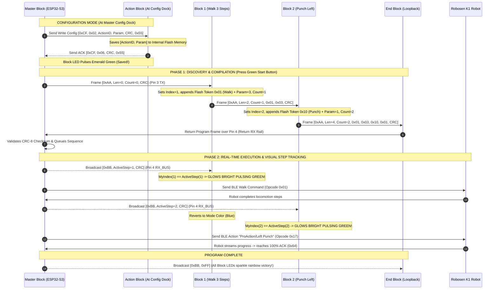

# Robosen Tangible Coding Block System: Comprehensive Project Summary & Scope

> **Project Name:** Tangible Modular Coding Block System for Robosen Robot  
> **Target Demographic:** Children aged 7 years old and under (Early Childhood / Kindergarten to Early Elementary)  
> **Core Purpose:** Screenless physical block-based coding to teach computational thinking, algorithm sequencing, and cause-and-effect through interactive humanoid robot control.  
> **Target Hardware:** Modular Physical Blocks (ESP32-S3 Master with E-Ink Config Dock + CH32V003 Slaves) $\longleftrightarrow$ Robosen K1 Humanoid Robot (Bluetooth Low Energy)  
> **Date:** August 2026  

---

## 1. Project Scope & Educational Mission

### 1.1 The Core Problem
Most modern coding curricula for children rely on tablets, smartphones, or computers (e.g., Scratch, Blockly). However, for **young children aged 7 and under**, screens present significant developmental hurdles:
- **Abstract vs. Concrete Cognition:** Children under 7 (Piaget’s Preoperational and early Concrete Operational stages) learn best through tactile, physical manipulation rather than abstract 2D screen coordinates.
- **Screen Fatigue & Distraction:** Excessive screen time can cause disengagement and cognitive overload.
- **Disconnected Output:** Controlling a virtual sprite on a screen does not provide the same visceral spatial awareness and excitement as watching a physical robot walk, punch, and balance in the real world.

### 1.2 The Project Solution: Tangible Modular Coding Blocks
This project creates a **tangible, screenless, modular programming system**. Children configure solid coding blocks on the Master's **Config Dock**, then snap them together in a line at the **Run Port**. When they press the big **Green "Go" Button** on the Master Block, the sequence compiles instantly and commands the **Robosen K1 humanoid robot** via Bluetooth Low Energy (BLE).

```text
┌──────────────────────────────────────────────────────────────────────────────────────────────────┐
│                                   PHYSICAL TANGIBLE CODING CHAIN                                 │
│                                                                                                  │
│   [ MASTER BLOCK ] ──► [ WALK BLOCK ] ──► [ TURN BLOCK ] ──► [ PUNCH BLOCK ] ──► [ END BLOCK ]   │
│   (Brain, Battery,     (Param: 3 steps)   (Param: 90° Right) (Action: Left Hook) (Terminator)    │
│    E-Ink Display,                                                                                │
│    2 Config Knobs,                                                                               │
│    Start Button)                                                                                 │
│          │                                                                                       │
│          ▼ (Bluetooth BLE 4.2 / 5.0 Stream)                                                      │
│   [ ROBOSEN K1 HUMANOID ROBOT ] ─── Executes commands step-by-step with real-time feedback!      │
└──────────────────────────────────────────────────────────────────────────────────────────────────┘
```

### 1.3 Key Foundational Coding Concepts Taught (Ages $\le 7$)
1. **Linear Sequence & Order of Execution:**  
   Children learn that computers/robots follow instructions strictly in order from left to right. Swapping the position of the *Walk* and *Punch* blocks changes what the robot does.
2. **Parameters & Modifiers (Master Block Rotary Dials & E-Ink):**  
   Children discover that actions have properties. Turning the physical dial on the Master dock updates the E-Ink display and flashes the block memory to set *how many steps* to walk (1 to 10), *what angle* to turn (45° to 180°), or *how many seconds* to wait.
3. **Real-Time Cause-and-Effect (Active Step Tracking):**  
   As the robot performs each action, the corresponding physical block **glows bright pulsating green**. The child can look at the glowing block, look at the robot moving, and instantly map the block to the physical motion.
4. **Debugging & Algorithmic Thinking:**  
   If the robot bumps into a toy or turns the wrong way, the child physically inspects the chain, identifies the incorrect block, snaps in the right one, and tries again.
5. **Loops & Repetition (Pattern Recognition):**  
   Introducing repeat blocks to understand that repeating an action is more efficient than chaining many identical blocks.

---

## 2. System Architecture & Physical Hardware Components

The system is composed of four primary hardware elements:

```text
┌────────────────────────────────────────────────────────────────────────────────────────────────────────┐
│                                       HARDWARE COMPONENT OVERVIEW                                      │
├────────────────────────────────────────────────────────────────────────────────────────────────────────┤
│                                                                                                        │
│  1. MASTER BLOCK (The Brain, Config Dock & BLE Gateway)                                                │
│     • Microcontroller: ESP32-S3 with Native Bluetooth BLE 5.0, SPI for E-Ink, and Dual UARTs           │
│     • Display: High-contrast 1.54"/2.13" E-Ink E-Paper screen showing action names, icons, & parameters│
│     • Controls: Knob 1 (Action Selector), Knob 2 (Parameter Adjuster), Large tactile "Start / Go" btn │
│     • Dual Interfaces: (1) Config Dock Port (to flash 1 block) + (2) Run Chain Port (execution track) │
│     • Power Source: Rechargeable 3.7V LiPo battery with USB-C TP4056 BMS charging & 3.3V Buck-Boost    │
│     • Visual Feedback: Master RGB Status LED with expressive light choreography (No noisy buzzer!)    │
│                                                                                                        │
│  2. SOLID SMART ACTION BLOCKS (The Modular Code Blocks)                                                │
│     • Microcontroller: Ultra-low-cost WCH CH32V003 (32-bit RISC-V, ~$0.15 in SOP-8 package)            │
│     • Solid Shell Design: ZERO buttons or knobs on individual blocks (drop-proof, indestructible)      │
│     • Memory: Stored Action Token ID & Parameter inside 192-byte internal non-volatile flash           │
│     • Visual Feedback: Addressable WS2812B RGB LED (indicates action color & glowing green execution)  │
│                                                                                                        │
│  3. END TERMINATOR BLOCK (The End of Code Marker)                                                      │
│     • Passive Bridge or Smart Terminator (with CH32V003 & green Ready LED)                             │
│     • Role: Loops downstream data back to the Master RX return rail to close the loop                  │
│                                                                                                        │
│  4. ROBOSEN K1 HUMANOID ROBOT (The Physical Avatar)                                                    │
│     • 17 high-precision digital servos, 6-axis gyroscope IMU, onboard speaker                          │
│     • Communicates wirelessly with Master Block via BLE Service 0xFFE0 / Char 0xFFE1                   │
│                                                                                                        │
└────────────────────────────────────────────────────────────────────────────────────────────────────────┘
```

### 2.1 Standardized 4-Pin Magnetic Pogo Connector Pinout
All blocks connect using child-friendly, polarized magnetic pogo pins:

| Pin # | Signal Name | Type | Purpose |
| :---: | :--- | :---: | :--- |
| **Pin 1** | **`V+` (3.3V)** | Power | Regulated 3.3V power supplied by Master Block |
| **Pin 2** | **`GND`** | Power | System common ground |
| **Pin 3** | **`UART TX_DOWN`** | Data (Out) | Cascading downstream line (Master $\to$ Block 1 $\to$ Block 2 $\dots \to$ End) / Config TX |
| **Pin 4** | **`UART RX_BUS`** | Bidirectional Bus | Continuous return rail for compiled program & active step broadcast bus / Config ACK |

---

## 3. Communication Protocol & Signal Flow



---

## 4. Current State of the Project

The project is currently in an **advanced software, protocol simulation, and live BLE validation stage**:

### 4.1 What Has Been Completed & Verified
1. **Full Robosen K1 BLE Protocol Reverse Engineering:**
   - Decoded 25+ opcodes on Service `0xFFE0` / Char `0xFFE1` (Locomotion `0x01-0x08`, Predefined Actions `0x17`, 17-Servo Joint Kinematics `0xE8/0xE9`, Telemetry `0x0F`, Keep-alive `0x0B`).
   - Discovered **dynamic 100% progress ACK resolution** on action streams, allowing instant, seamless action transitions without arbitrary delay timers.
   - Verified live with physical robot `K1-00457` (Firmware `VER:3.03L`, MAC `3C:A5:51:94:97:70`).

2. **Native Python BLE Control & Daemon Layer:**
   - [`scripts/k1_ble_daemon.py`](scripts/k1_ble_daemon.py): High-performance background daemon holding a persistent BLE connection with IPC JSON messaging.
   - [`scripts/k1_action.py`](scripts/k1_action.py): Instant action runner and telemetry inspector CLI.
   - [`scripts/k1_ble_tester.py`](scripts/k1_ble_tester.py): Interactive console telemetry and motion control suite.

3. **Complete Node-RED Tangible Block Simulator Suite (`node-red-contrib-robosen-block`):**
   - **`robosen-master`**: Simulates the Master Block, emits `0xAA` discovery seed, verifies CRC-8, coordinates BLE execution, and broadcasts `0xBB` real-time step frames.
   - **`robosen-smart-block`**: Simulates the CH32V003 Smart Block with flash parameter storage and dynamic WS2812B RGB LED color states.
   - **`robosen-smart-end`**: Simulates the active end terminator with CRC-8 validation, loopback return, and fault injection capabilities.
   - **`robosen-protocol-monitor`**: Real-time packet analyzer decoding binary hex frames, tokens, parameters, and checksum integrity.
   - **Ready-to-run simulation flows**: [`robosen_smart_block_flow.json`](node-red-contrib-robosen-block/examples/robosen_smart_block_flow.json) and [`robosen_simulator_flow.json`](node-red-contrib-robosen-block/examples/robosen_simulator_flow.json).

4. **Hardware & Electrical Architecture Specifications:**
   - Completed detailed hardware documentation ([`PHYSICAL_BLOCK_SYSTEM_SPEC.md`](PHYSICAL_BLOCK_SYSTEM_SPEC.md)) defining 4-pin pogo pinout, power consumption, CH32V003 SOP-8 pinouts, and CRC-8 algorithms.

---

## 5. Master Improvement Plan & Future Roadmap

```text
+---------------------------------------------------------------------------------------------------+
|                                    5-PILLAR IMPROVEMENT ROADMAP                                   │
+-----------------+-----------------+------------------+--------------------+-----------------------+
|   1. HARDWARE   |   2. PROTOCOL   |   3. MASTER BLE  |   4. CHILD UX &    |   5. SOLID BLOCKS     |
|   & POWER BOM   |  & RESILIENCE   |     FIRMWARE     |   LIGHT LANGUAGE   |  & CONFIG DOCK        |
+-----------------+-----------------+------------------+--------------------+-----------------------+
| • $0.15 RISC-V  | • CRC-8 Checks  | • Standalone C++ │ • E-Ink Display    | • Central Config Dock |
|   (CH32V003)    | • Hot-plug Safe │   ESP32-S3 app   │ • WS2812B RGB LEDs │ • Zero Moving Parts   |
| • LiPo + USB-C  | • RC Debouncing │ • 100% ACK Sync  │ • Friendly Icons   │ • Internal Flash Mem  |
| • Mag Snap Pins │ • Contact Noise │ • Fall Recovery  │ • Silent Classroom │ • Drop-Proof Enclosure|
+-----------------+-----------------+------------------+--------------------+-----------------------+
```

### Pillar 1: Hardware & Power BOM Optimization
- **Ultra-Low Cost Slave MCUs:** Transition all instruction blocks to **WCH CH32V003** 32-bit RISC-V microcontrollers in SOP-8 package (~$0.15 per block vs. $2.50+ for ESP32). Reduces block cost by 90% and idle current from 50 mA to $< 10\,\mu\text{A}$.
- **Rechargeable Master Power:** Single 3.7V LiPo/18650 cell with onboard TP4056 USB-C charging and battery management protection (BMS).
- **Polarized Magnetic Snap Pins:** Self-aligning magnetic pogo pin connectors that prevent reverse polarity connections and snap together effortlessly for little hands.

### Pillar 2: Protocol Resilience & Child-Proofing (Hot-Plug Tolerance)
- **Contact Bounce Suppression:** 10 kΩ pull-ups and 22 pF RC filtering on UART pins to eliminate electrical glitches when children wiggle blocks.
- **Graceful Error Recovery:** If a child unplugs a block mid-execution, the Master catches the break within 50 ms, stops the robot safely, and flashes the affected block red rather than crashing.

### Pillar 3: Master ESP32-S3 Standalone Embedded Firmware & Smart NVS Pairing
- **Full Embedded Port:** Flash the non-blocking command queue directly onto the Master ESP32-S3 in C++ (ESP-IDF / Arduino), eliminating the need for a laptop, Python script, or Node-RED in the final classroom setup.
- **Multi-Robot Smart NVS Binding:** Boots and connects directly to the last-paired robot MAC in $<500\,\text{ms}$, preventing classroom crosstalk.
- **Teacher E-Ink Pairing Menu:** Hold Start for 3 seconds to scan, sort nearby robots by RSSI proximity, select via Knob 1, and save as the new persistent default MAC.

### Pillar 4: Child-Centric UX, Light Language & Enclosures
- **Visual Color-Coded Actions:**
  - 🔵 **Blue:** Walk Forward / Backward
  - 🔷 **Cyan:** Turn Left / Right
  - 🔴 **Red:** Left / Right Punch
  - 🟠 **Orange:** Kung Fu Routine
  - 🟣 **Magenta:** Dance / Boogaloo
  - 🟡 **Yellow:** Wait Delay
  - 🟢 **Bright Pulsing Green:** Currently Executing Step!
- **E-Ink Display Visuals:** Shows text, large icons, and parameter counts in crystal-clear, sunlight-readable e-paper.
- **Expressive Light Choreography (No Buzzer):** Emerald green success pulse, data comet compilation wave, and rainbow celebration sparkle.
- **Drop-Proof Solid Enclosures:** 3D-printed / injection-molded ABS enclosures with soft rounded corners and zero mechanical dials to break.

---

## 6. Summary Comparison Table

| Metric / Feature | Current State (Software & Simulation) | Target Physical Hardware Product |
| :--- | :--- | :--- |
| **Execution Environment** | Node-RED & Python BLE Background Daemon | Standalone ESP32-S3 Master Block (No PC needed) |
| **Master UI & Display** | Node-RED Web Dashboard | E-Ink Display + Dual Rotary Dials + Start Button |
| **Instruction Blocks** | Simulated Node-RED Smart Block Nodes | Solid CH32V003 RISC-V Snap Blocks (No buttons/knobs) |
| **Configuration Method** | Node-RED UI Dropdowns | Master Block Config Dock (`0xCF` UART Flash) |
| **Inter-Block Bus** | Simulated 2-Phase Binary Frames (`0xAA`/`0xBB`) | 4-Pin Magnetic Pogo Pin UART Daisy-Chain |
| **Visual Feedback** | Node-RED UI Status Badges | Addressable WS2812B RGB LEDs (Light Choreography) |
| **Audio Feedback** | System Audio / Console Alerts | Silent Classroom (Robot's built-in speaker only) |
| **BOM Cost per Block** | N/A (Software) | **~$0.25 – $0.35** per physical block |
| **Target User Experience** | Technical Testing & Developer Prototyping | Screenless, Tactile STEM Toy for Kids $\le 7$ |

---

## 7. Recommended Next Steps

1. **PCB Schematic & Layout:** Design the 4-pin magnetic PCB for the ESP32-S3 Master Block (with E-Ink & dual knobs) and solid CH32V003 Action Block.
2. **C++ Master Firmware:** Port the asynchronous queue engine and E-Ink UI into ESP-IDF / Arduino for ESP32-S3.
3. **CH32V003 Slave Firmware:** Implement the Config Port flash writer (`0xCF`), Phase 1 flash reader (`0xAA`), and Phase 2 LED tracker (`0xBB`) in RISC-V C.
4. **3D Casing Prototypes:** 3D print initial snap-fit solid block shells with magnetic polarity channels and light pipes for the WS2812B LEDs.
5. **Classroom User Testing:** Pilot test 5-block sets with 5–7 year old children to validate physical usability and E-Ink dock ergonomics.

