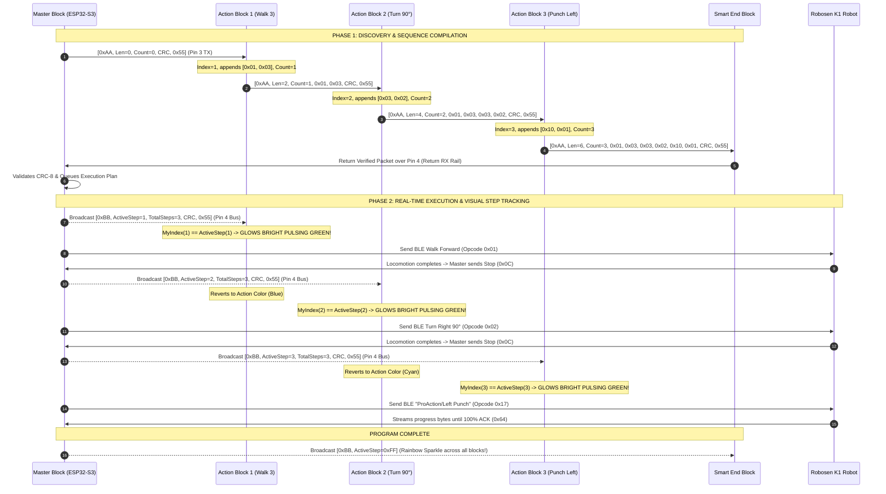

# 📘 Prototype #01: Comprehensive Engineering Specification & Report Memory

> **Project:** Tangible Modular Physical Block Coding System for Robosen K1 Humanoid Robot  
> **Iteration:** Prototype #01 (5-Block Breadboard Set)  
> **Document Purpose:** Complete technical reference, hardware pinouts, protocol specifications, electrical schematics, and experimental data for academic coursework & engineering reports.  
> **Author:** Nantaphat Yoktaworn  
> **Date:** August 26, 2026  
> **Repository:** `https://github.com/Nantaphat-Yoktaworn/robosen_block.git` (Private)

---

## 1. Executive Summary & Educational Mission

### 1.1 The Pedagogical Problem
Early childhood learners ($\le 7$ years old, Piaget’s Preoperational and early Concrete Operational stages) face severe developmental barriers when learning computational thinking through 2D touchscreens (Scratch, Blockly, tablet apps):
1. **Abstract vs. Concrete Spatial Cognition:** Screen coordinates and drag-and-drop interfaces fail to engage fine motor coordination and spatial kinesthetic reasoning.
2. **Screen Fatigue & Overstimulation:** Tablet interfaces distract young children from physical collaboration.
3. **Audio Pollution in Classrooms:** Traditional buzzer-based coding toys create loud acoustic chaos in classrooms with 5–10 concurrent student groups.

### 1.2 The Tangible Physical Solution
This system provides a **100% screenless, tangible, modular physical coding experience**:
* Children configure solid, indestructible coding blocks on a centralized **Master Config Dock** using tactile rotary knobs and an **E-Ink display**.
* They snap the blocks together into a linear sequence at the **Run Port**.
* Pressing the **Green Start Button** compiles the physical algorithmic sequence via a **2-Phase Bi-Directional UART Bus (CRC-8)**, commands the **Robosen K1 bipedal humanoid robot** via **Bluetooth Low Energy (BLE)**, and animates each physical block with **bright pulsating green LEDs** in real-time sync with the robot's physical motions.

---

## 2. Prototype #01 Set Architecture & Scope

Prototype #01 is an un-cased, breadboard-mounted proof-of-concept consisting of **5 distinct modular units**:

```text
┌──────────────────────────────────────────────────────────────────────────────────────────────────┐
│                               PROTOTYPE #01 HARDWARE TOPOLOGY                                    │
│                                                                                                  │
│   [ MASTER BLOCK ] ──► [ ACTION BLOCK 1 ] ──► [ ACTION BLOCK 2 ] ──► [ ACTION BLOCK 3 ] ──► [ END]
│   • ESP32-S3 N16R8     • CH32V003F4P6         • CH32V003F4P6         • CH32V003F4P6         • CH32V003
│   • 2.13" E-Ink        • WS2812B RGB          • WS2812B RGB          • WS2812B RGB          • WS2812B
│   • 2x KY-040 Knobs    • Flash Action Memory  • Flash Action Memory  • Flash Action Memory  • CRC Loop
│   • Start Button                                                                                 │
│   • Config Port (Dock)                                                                           │
│   • Run Port (Chain)                                                                             │
│          │                                                                                       │
│          ▼ (Bluetooth 5.0 BLE Stream)                                                            │
│   [ ROBOSEN K1 BIPEDAL ROBOT ] ──────────────────────────────────────────────────────────────────┘
└──────────────────────────────────────────────────────────────────────────────────────────────────┘
```

---

## 3. Bill of Materials (BOM) & Procurement (`P01BOM.pdf`)

All components were sourced for rapid breadboard prototyping at low cost:

| # | Item Description | Exact Model / Spec | Qty | Unit Price (THB) | Total (THB) | Prototype Role |
| :---: | :--- | :--- | :---: | :---: | :---: | :--- |
| **1** | **Master Controller** | `ESP32-S3-DevKitC-1-WROOM-1-N16R8` *(Dual USB-C, 16MB Flash, 8MB PSRAM, Soldered Pins)* | 1 | 105 | 105 | Master Brain, BLE Central Gateway, E-Ink SPI Driver, Config Dock UART & Run Chain Coordinator. |
| **2** | **Solderless Breadboards** | `MB-102 830-Point Solderless Breadboard` *(with Dual Power Distribution Rails)* | 5 | 32 | 160 | 1 Breadboard dedicated to Master; 3 for Action Blocks; 1 for Smart End Block. |
| **3** | **Jumper Wires (M-M)** | `40-Pin Dupont Jumper Wires (10cm Male-to-Male)` | 1 pk | 27 | 27 | Inter-block daisy chain bus rails and breadboard power wiring. |
| **4** | **Jumper Wires (M-F)** | `40-Pin Dupont Jumper Wires (10cm Male-to-Female)` | 1 pk | 27 | 27 | Connections from ESP32-S3 to E-Ink display and KY-040 rotary encoder modules. |
| **5** | **Tactile Start Button** | `12x12x7.3mm Momentary Tactile Push Button Switch with Round Cap (4-Pin DIP)` | 1 pk (10x) | 66 | 66 | Large tactile Master Start / Run trigger button. |
| **6** | **Rotary Encoders** | `AB024 / KY-040 Rotary Encoder Module` *(EC11 with PCB, 20 Detents/Rev, 5-Pin Header)* | 2 | 39 | 78 | **Knob 1** (Action Selector) & **Knob 2** (Parameter Adjuster) with tactile detents & push click. |
| **7** | **Action Block MCUs** | `TENSTAR CH32V003F4P6 Core Development Board` *(TSSOP-20 Breakout, 48MHz RISC-V)* | 4 | 30 | 120 | **3x Action Blocks + 1x Smart End Block**. Contains internal 192B Data Flash. |
| **8** | **Addressable RGB LEDs** | `WS2812 5050 Single-Pixel Breakout Board (3-Pin VCC/GND/DIN)` | 5 | 8 | 40 | Visual light language indicators (1 Master + 3 Action Blocks + 1 End Block). |
| **9** | **E-Ink Display Module** | `2.13" E-Paper Display Module SSD1680 / JD79661` *(122x250 Pixel, SPI Interface)* | 1 | 429 | 429 | High-contrast sunlight readable display with fast partial refresh (~0.3s). |
| **TOTAL** | — | — | — | — | **1,052 THB** | **Complete 5-Block Prototype Set** *(~$31.00 USD)* |

---

## 4. Electrical & Power Architecture

### 4.1 Unified 3.3V Single-Rail Power Distribution
Every active component in Prototype #01 runs natively on **+3.3V logic and power**:
* **Power Source:** 5V USB-C input from PC or 5V Power Bank into the ESP32-S3 development board.
* **Regulation:** The ESP32-S3 onboard Low-Dropout (LDO) regulator converts 5V $\to$ **3.3V DC** (capable of delivering up to 800 mA continuous current).
* **Zero Level Shifters:** The ESP32-S3, CH32V003 RISC-V microcontrollers, SSD1680 E-Ink display, KY-040 encoders, and WS2812 RGB LEDs all interface directly at **3.3V CMOS logic**.

```text
┌────────────────────────────────────────────────────────────────────────────────────────┐
│                               UNIFIED 3.3V POWER SYSTEM                                │
│                                                                                        │
│  [ USB-C 5V Input ] ──► [ ESP32-S3 Onboard 3.3V LDO ] ──► +3.3V Common Power Rail      │
│                                                                  │                     │
│         ┌──────────────────┬─────────────────┬───────────────────┼─────────────────────┤
│         ▼                  ▼                 ▼                   ▼                     ▼
│    [ ESP32-S3 ]     [ E-Ink Screen ]  [ KY-040 Knobs ]   [ CH32V003 MCUs ]     [ WS2812 LEDs ]
│    (Master Brain)     (3.3V SPI)       (3.3V Pull-up)     (3.3V UART Bus)       (3.3V Logic)
│                                                                                        │
│  [ GND Bus Rail ] ─────────────────────────────────────────────────────────────────────┘
└────────────────────────────────────────────────────────────────────────────────────────┘
```

### 4.2 Decoupling & Noise Suppression
* **0.1 µF (100 nF) Ceramic Decoupling Capacitors:** Placed directly across `VDD` and `GND` pins of each CH32V003 board to suppress high-frequency switching noise.
* **10 kΩ Bus Pull-up Resistors:** Placed on UART bus lines (`Pin 3 TX_DOWN` and `Pin 4 RX_BUS`) to eliminate floating line glitches when jumper wires are disconnected or wiggled.

---

## 5. Complete Breadboard Pinout & Wiring Specifications

### 5.1 Master Controller (ESP32-S3 Pin Allocations)

| Peripheral | Signal Name | ESP32-S3 GPIO Pin | Function / Description |
| :--- | :--- | :---: | :--- |
| **E-Ink Display (SPI)** | `BUSY` | **GPIO 4** | Active High/Low busy signal (indicates screen refresh in progress) |
| | `RST` | **GPIO 5** | Hardware Reset line |
| | `DC` | **GPIO 6** | Data / Command selection line |
| | `CS` | **GPIO 7** | SPI Chip Select |
| | `SCK` | **GPIO 15** | SPI Clock |
| | `DIN (MOSI)` | **GPIO 16** | SPI Master Out Slave In |
| **Knob 1 (Action Selector)** | `CLK (Phase A)` | **GPIO 8** | Quadrature encoder input A (Rotary direction detection) |
| | `DT (Phase B)` | **GPIO 9** | Quadrature encoder input B |
| | `SW (Push Switch)` | **GPIO 10** | Built-in shaft push-button (Action select confirmation) |
| **Knob 2 (Param Adjuster)** | `CLK (Phase A)` | **GPIO 11** | Quadrature encoder input A (Parameter direction detection) |
| | `DT (Phase B)` | **GPIO 12** | Quadrature encoder input B |
| | `SW (Push Switch)` | **GPIO 13** | Built-in shaft push-button (Param select confirmation) |
| **Start / Run Button** | `TRIG_BTN` | **GPIO 14** | Active Low push button with internal pull-up (Initiates sequence) |
| **Master Status RGB LED** | `WS2812_DATA` | **GPIO 21** | Single-wire NRZ timing signal for WS2812 status LED |
| **Config Port (Dock UART1)**| `CFG_TX` | **GPIO 17** | Sends Write Config (`0xCF`) packet to single docked block |
| | `CFG_RX` | **GPIO 18** | Receives ACK response from docked block |
| **Run Port (Chain UART2)** | `CHAIN_TX (Pin 3)`| **GPIO 43** | Emits Phase 1 compilation seed frame (`0xAA`) down the chain |
| | `CHAIN_RX (Pin 4)`| **GPIO 44** | Receives Phase 1 return packet & broadcasts Phase 2 active steps (`0xBB`)|

---

### 5.2 Action Block & Smart End Block (CH32V003 Pin Allocations)

The WCH CH32V003F4P6 runs a **single unified RISC-V firmware binary** configured dynamically by pin wiring:

```text
                      CH32V003F4P6 (TSSOP-20 / SOP-8)
                              +-------------+
              (V+ 3.3V)   1 --| VDD     GND |-- 20  (Common GND)
               (Unused)   2 --| PA1     PC4 |-- 19  (Unused)
          (WS2812 Data)   3 --| PA2     PC3 |-- 18  (Unused)
          (SWIO / NRST)   4 --| PD1     PC2 |-- 17  (Unused)
               (Unused)   5 --| NRST    PC1 |-- 16  (Unused)
               (Unused)   6 --| PD2     PC0 |-- 15  (Unused)
               (Unused)   7 --| PD3     PD7 |-- 14  (Unused)
               (Unused)   8 --| PD4     PD6 |-- 13  (UART RX - Pin 3 In / Config In)
    (UART TX - Pin 3 Out) 9 --| PD5     PD0 |-- 12  (Role Detect: GND=End, Float=Action)
               (Unused)  10 --| PA0     OSC |-- 11  (Internal 24MHz Oscillator)
                              +-------------+
```

* **Pin `PD6` (UART RX):** Connected to upstream block's TX line.
* **Pin `PD5` (UART TX):** Connected to downstream block's RX line.
* **Pin `PA2` (WS2812 DIN):** Connected to onboard WS2812 RGB LED data input.
* **Pin `PD0` (Role Detect):** 
  * If left floating (internal pull-up High) $\to$ Operates as **Action Block**.
  * If tied to GND $\to$ Operates as **Smart End Block** (validates CRC-8 and loops TX to Pin 4 return rail).
* **Pin `PD1` (SWIO):** 1-wire programming line used for initial factory firmware flashing.

---

## 6. Multi-Robot Classroom BLE Pairing Architecture (Smart NVS Binding)

In classroom deployments with multiple Robosen K1 robots and Master Blocks in the same room, open BLE auto-discovery causes accidental crosstalk. Prototype #01 uses a **3-Tier Smart Persistent Pairing Architecture**:

```text
┌────────────────────────────────────────────────────────────────────────────────────────┐
│                              SMART NVS BLE PAIRING LIFECYCLE                           │
│                                                                                        │
│  [ Power On ] ──► [ Read Target MAC from NVS ] ──► [ Direct Connect (<500ms) ] ──► [OK]
│                          │
│                          ▼ (If Start Button or Knob Click held for 3 seconds)
│                  [ E-Ink Teacher Pairing Menu ]
│                  - Scans nearby "K1-*" advertising packets
│                  - Filters & sorts by RSSI Proximity (Nearest robot on top)
│                  - Turn Knob 1 to select -> Click to save
│                  - Writes new target MAC to NVS as persistent default
└────────────────────────────────────────────────────────────────────────────────────────┘
```

### 6.1 Direct Instant Connection (< 500 ms)
* The target robot MAC address (`last_paired_mac`) and device name are stored in the ESP32-S3 **Non-Volatile Storage (NVS Flash)** partition.
* On power-up, the Master skips RF scanning and establishes an immediate BLE connection directly to its designated MAC address in $< 500\,\text{ms}$.
* **Classroom Isolation:** Group 1's Master will never command Group 2's robot.

### 6.2 E-Ink Teacher Pairing Menu (Hot-Swap / Re-Pairing)
If a robot's battery runs low during class, the teacher can swap robots in 5 seconds without a computer:
1. Long-press the Start button or Knob click for **3 seconds**.
2. The ESP32-S3 scans nearby BLE devices and displays a sorted list on the **2.13" E-Ink screen**:
   ```text
   ┌────────────────────────────────┐
   │       PAIR ROBOSEN ROBOT       │
   │                                │
   │ ► [1] K1-00457  (RSSI -42 dBm) │ ◄── Closest robot on desk
   │   [2] K1-00892  (RSSI -68 dBm) │
   │   [3] K1-00311  (RSSI -81 dBm) │
   │                                │
   │  Turn Knob to Select & Click   │
   └────────────────────────────────┘
   ```
3. Rotating **Knob 1** moves the selection cursor; **clicking the knob** saves the selected MAC into NVS memory as the new permanent default.

---

## 7. Dual Communication Protocols (UART Binary Frames)

### 7.1 Protocol 1: Config Port Protocol (`0xCF`)
Used exclusively when a single Action Block is placed on the Master's **Config Dock**:

```text
Master -> Docked Block:  [ 0xCF, 0x02, ACTION_ID, PARAM_VAL, CRC8, 0x55 ]
Docked Block -> Master:  [ 0xCF, 0x06, CRC8, 0x55 ] (ACK: Configuration Written to Flash)
```

* **Action Block Memory Operation:** The CH32V003 writes the received `[ACTION_ID, PARAM_VAL]` into its internal **192-byte non-volatile Data Flash**.
* **LED Feedback:** Block LED flashes an **Emerald Green Success Pulse** to confirm the setting is saved permanently.

---

### 7.2 Protocol 2: Run Chain 2-Phase Bi-Directional Bus Protocol

#### Phase 1: Dynamic Discovery & Sequence Compilation (`0xAA`)
When the child presses the Start button:
1. **Master Emits Seed:** `[0xAA, Len=0, Count=0, CRC=0x00, 0x55]` on Pin 3 TX.
2. **Block #1 Receives:** Assigns itself `MyIndex = 1`. Appends its Flash-stored `[ActionID, ParamVal]`, increments `Count=1`, recalculates CRC-8, and forwards downstream.
3. **Block #2 Receives:** Assigns itself `MyIndex = 2`. Appends its stored `[ActionID, ParamVal]`, increments `Count=2`, recalculates CRC-8, and forwards downstream.
4. **Block #3 Receives:** Assigns itself `MyIndex = 3`. Appends its stored `[ActionID, ParamVal]`, increments `Count=3`, recalculates CRC-8, and forwards downstream.
5. **Smart End Block Receives:** Validates the cumulative CRC-8 checksum, appends the verified footer `0x55`, and loops the entire binary payload back into the **Pin 4 Return RX Rail**.
6. **Master Validates:** Master parses the program, verifies CRC-8 integrity, and initiates robot execution.



#### Phase 2: Real-Time Execution & WS2812B Step Tracking (`0xBB`)
* During execution, the Master broadcasts `[0xBB, ACTIVE_STEP, TOTAL_STEPS, CRC8, 0x55]` across the Pin 4 Bus.
* **Block Behavior:**
  * If `MyIndex == ACTIVE_STEP`: The block's WS2812B LED turns **Bright Pulsating Green (100% brightness)** to show children exactly what the robot is thinking and doing!
  * All other blocks remain dim (20% brightness) in their configured Action Mode color.
  * When the program finishes (`ACTIVE_STEP = 0xFF`), all blocks trigger a synchronized **Rainbow Sparkle Victory Celebration**.

---

## 8. Visual Light Language Choreography (Silent Classroom Design)

To avoid disruptive classroom audio noise, all sound buzzers are eliminated in favor of rich **WS2812B RGB light choreography**:

| State / Trigger | Master Status LED | Action Block LED Behavior | E-Ink Display Status | Visual Pedagogical Meaning |
| :--- | :--- | :--- | :--- | :--- |
| **Block Docked (Config Port)** | Soft cyan glow | Gentle cyan fade-in pulse | Displays current block action & value | *"Block recognized & ready to program"* |
| **Action Changed (Knob 1)** | Morphs to action color | Morphs instantly to Action Color | Updates Action Name & Icon | *"Action selected"* |
| **Param Changed (Knob 2)** | E-Ink text updates | Flashes $N$ times rapidly (e.g. 3 blinks = 3 steps) | Updates numerical parameter | *"Parameter value preview"* |
| **Config Saved (Flash Write)** | Single green flash | **Emerald Green "Success Pulse"** | Shows "SAVED ✓" badge | *"Saved to block flash memory permanently"* |
| **Start Press (Phase 1)** | Bright white pulse | **"Data Comet Wave":** Fast light pulse sweeps Block 1 $\to$ 2 $\to$ 3 $\to$ End | Shows "RUNNING..." status | *"Program compiled & verified via CRC-8"* |
| **Active Execution (Phase 2)**| Solid green | **Bright pulsating green (100%)** on active step; others dim (20%) | Displays active step index and timer | *"Robot is currently executing this block"* |
| **Program Finished** | Rainbow ripple | **Synchronized Rainbow Sparkle** across all blocks | Displays "MISSION COMPLETE 🎉" | *"Algorithm completed successfully!"* |
| **Error / Broken Chain** | Double red flash | Double red flash on disconnected block | Displays "ERROR: Check Chain ⚠️" | *"Check magnetic pogo contact"* |

---

## 9. Action Token & Color Catalog

| Token ID | Action Name | Parameter (Knob 2) | Robosen BLE Opcode & Packet | LED Color & Hex Code |
| :---: | :--- | :--- | :--- | :---: |
| `0x01` | `MOVE_FORWARD` | Steps (`1`–`10`) | `0x01` (`ffff020103` + Stop `0x0C`) | 🔵 Blue (`#1E88E5`) |
| `0x02` | `MOVE_BACKWARD`| Steps (`1`–`10`) | `0x05` (`ffff020507` + Stop `0x0C`) | 🔵 Dark Blue (`#1565C0`) |
| `0x03` | `TURN_LEFT` | Angle (`45°`, `90°`, `135°`, `180°`) | `0x08` (`ffff02080a` + Stop `0x0C`) | 🔷 Cyan (`#00ACC1`) |
| `0x04` | `TURN_RIGHT` | Angle (`45°`, `90°`, `135°`, `180°`) | `0x02` (`ffff020204` + Stop `0x0C`) | 🔷 Cyan (`#00ACC1`) |
| `0x07` | `MOVE_LEFT` | Side-steps (`1`–`5`) | `0x07` (`ffff020709` + Stop `0x0C`) | 🟦 Sky Blue (`#039BE5`) |
| `0x08` | `MOVE_RIGHT` | Side-steps (`1`–`5`) | `0x03` (`ffff020305` + Stop `0x0C`) | 🟦 Sky Blue (`#039BE5`) |
| `0x10` | `LEFT_PUNCH` | Style (`1`–`3`) | `0x17` (`"ProAction/Left Punch"`) | 🔴 Red (`#E53935`) |
| `0x11` | `RIGHT_PUNCH`| Style (`1`–`3`) | `0x17` (`"ProAction/Right Punch"`) | 🔴 Bright Red (`#D32F2F`) |
| `0x12` | `KUNG_FU` | Routine (`1`–`3`) | `0x17` (`"ProAction/Kung Fu"`) | 🟠 Orange (`#FB8C00`) |
| `0x13` | `DANCE_BOOGALOO`| Track (`1`–`2`) | `0x17` (`"Action/Boogaloo"`) | 🟣 Magenta (`#8E24AA`) |
| `0x14` | `PUSH_UPS` | Reps (`1`–`3`) | `0x17` (`"ProAction/Push Ups"`) | 🟤 Brown (`#6D4C41`) |
| `0x15` | `HANDSTAND` | Duration (`1`–`3`) | `0x17` (`"ProAction/Handstand"`) | 🟤 Brown (`#6D4C41`) |
| `0x20` | `HEAD_MOVE` | Angle (`42`–`202`) | `0xE8` (Servo index 16, standing pose safe) | 🩵 Teal (`#00897B`) |
| `0x30` | `WAIT_DELAY` | Seconds (`1`–`5`s) | Master internal non-blocking sleep timer | 🟡 Yellow (`#FBC02D`) |
| `0x40` | `REPEAT_LOOP`| Iterations (`2x`–`5x`)| Master execution queue sub-loop | 🟢 Lime (`#7CB342`) |

---

## 10. Software & Firmware Toolchain

### 10.1 Master Block Firmware (ESP32-S3)
* **Framework:** Arduino / ESP-IDF (C++)
* **Display Driver:** `GxEPD2` library configured for `SSD1680` (122x250) with Fast Partial Refresh (`display.displayWindow(...)`).
* **BLE Stack:** `NimBLE-Arduino` (Low-overhead BLE Central client).
* **Storage:** ESP32 `Preferences` / `nvs_flash` for persistent MAC and configuration storage.

### 10.2 Action Block Firmware (CH32V003 RISC-V)
* **Toolchain:** `WCH-Interrupt-Fast` / `ch32v003fun` / MounRiver Studio RISC-V GCC.
* **Flash Writing:** `FLASH_Unlock_Fast()` writes `[TokenID, Param]` directly to sector 63 (User Data Flash).
* **WS2812B Bitbang:** Cycle-accurate assembly routine driving `PA2` at 800 kHz NRZ timing.

### 10.3 Development & Debugging Utilities
* **Interactive CLI Runner:** [`scripts/k1_action.py`](file:///C:/Users/poomz/nnnn/robosen_block/scripts/k1_action.py) (Supports all actions, posture resets, and `volume <0-100%>`).
* **BLE Telemetry Suite:** [`scripts/k1_ble_tester.py`](file:///C:/Users/poomz/nnnn/robosen_block/scripts/k1_ble_tester.py).
* **17-Joint Kinematics Controller:** [`scripts/k1_joint_controller.py`](file:///C:/Users/poomz/nnnn/robosen_block/scripts/k1_joint_controller.py).
* **Node-RED Simulation Simulator:** [`node-red-contrib-robosen-block/`](file:///C:/Users/poomz/nnnn/robosen_block/node-red-contrib-robosen-block/).

---

## 11. Step-by-Step Breadboard Assembly & Testing Guide

```text
========================================================================================
                          STEP-BY-STEP PROTOTYPE ASSEMBLY
========================================================================================

STEP 1: MASTER BREADBOARD WIRING
  1. Mount the ESP32-S3 Dev Board on Breadboard #1.
  2. Connect ESP32-S3 3V3 pin to Breadboard Red (+) Rail; GND pin to Blue (-) Rail.
  3. Wire the 2.13" E-Ink SPI lines:
     BUSY -> GPIO 4, RST -> GPIO 5, DC -> GPIO 6, CS -> GPIO 7, SCK -> GPIO 15, DIN -> GPIO 16.
  4. Wire Knob 1 (KY-040): CLK -> GPIO 8, DT -> GPIO 9, SW -> GPIO 10, VCC -> 3.3V, GND -> GND.
  5. Wire Knob 2 (KY-040): CLK -> GPIO 11, DT -> GPIO 12, SW -> GPIO 13, VCC -> 3.3V, GND -> GND.
  6. Wire Start Button: Pin 1 -> GPIO 14, Pin 2 -> GND.
  7. Wire Master WS2812 LED: DIN -> GPIO 21, VCC -> 3.3V, GND -> GND.

STEP 2: ACTION & END BLOCK WIRING
  1. Place 1x TENSTAR CH32V003 board on each of Breadboards #2, #3, #4, #5.
  2. Connect all breadboard 3.3V and GND rails together using M-M jumper wires.
  3. On each CH32V003 board, wire WS2812 DIN to Pin PA2.
  4. On Breadboard #5 (Smart End Block), bridge Pin PD0 to GND (activates End Mode).

STEP 3: CONFIG DOCK TESTING
  1. Wire Master GPIO 17 (TX) -> Action Block PD6 (RX).
  2. Wire Master GPIO 18 (RX) -> Action Block PD5 (TX).
  3. Turn Knob 1 to "PUNCH_LEFT", Knob 2 to "1", press Knob click to save.
  4. Confirm Action Block LED flashes Emerald Green and saves to flash.

STEP 4: RUN CHAIN EXECUTION
  1. Wire Master GPIO 43 (Chain TX) -> Block 1 PD6 (RX).
  2. Wire Block 1 PD5 (TX) -> Block 2 PD6 (RX).
  3. Wire Block 2 PD5 (TX) -> Block 3 PD6 (RX).
  4. Wire Block 3 PD5 (TX) -> End Block PD6 (RX).
  5. Wire End Block PD5 (TX) -> Master GPIO 44 (Chain RX) AND connect to all Block Pin PD6 listen taps.
  6. Press Master Start Button -> Observe Data Comet wave, BLE robot execution, and live green step LEDs!
```

---

## 12. Future Production Transition: From Breadboard to Custom PCB

When transitioning from this Prototype #01 to final injection-molded / 3D-printed blocks:
1. **Raw IC Replacement:** Replace CH32V003 development boards with raw **`CH32V003J4M6` (SOP-8)** ICs (~$0.15 / 5 THB).
2. **Compact PCB:** Design a tiny 18mm $\times$ 18mm custom PCB for each action block with only 3 components:
   * 1x CH32V003 IC
   * 1x 0.1 µF ceramic capacitor
   * 1x WS2812B RGB LED
3. **Magnetic Pogo Pins:** Replace jumper wires with 4-pin self-aligning polarized magnetic pogo connectors.
4. **Drop-Proof Durability:** Enclose electronics in ultrasonic-welded ABS/PLA blocks with zero moving parts.
