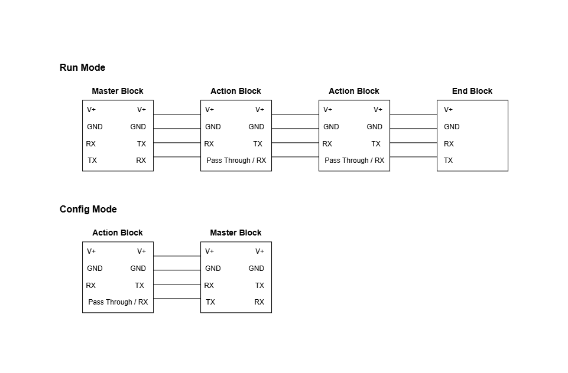
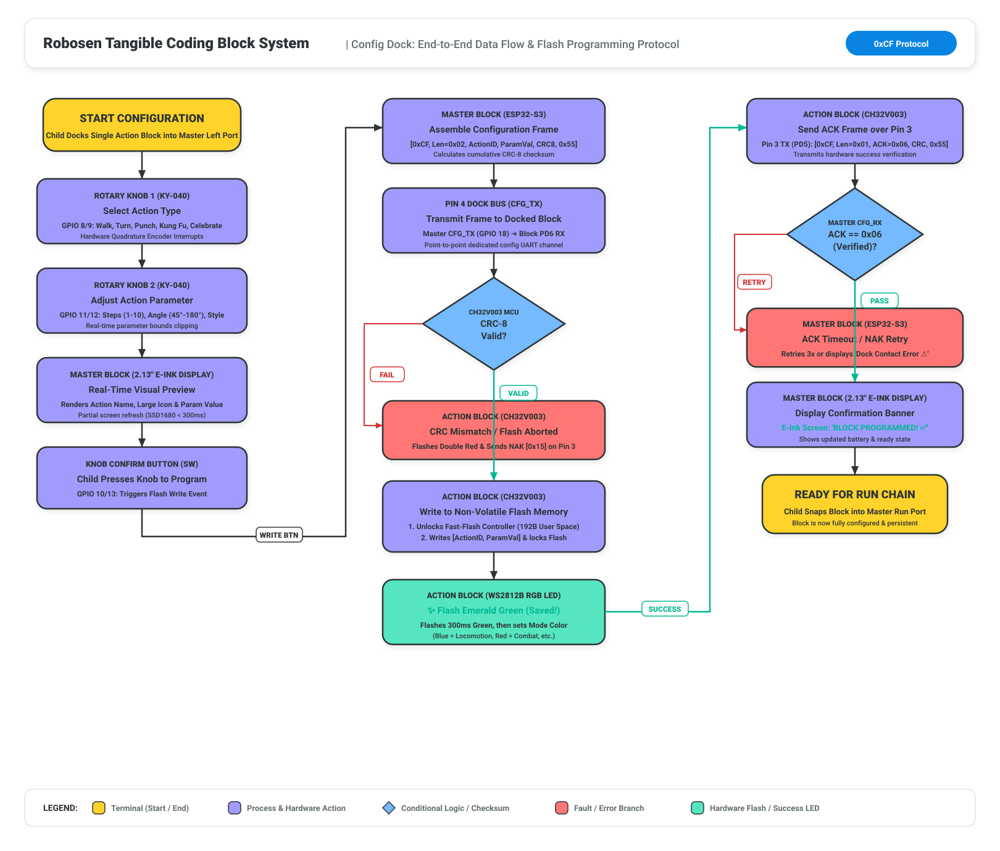
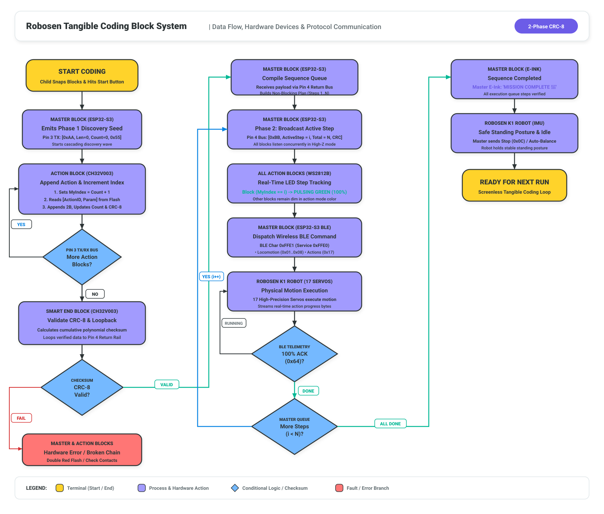
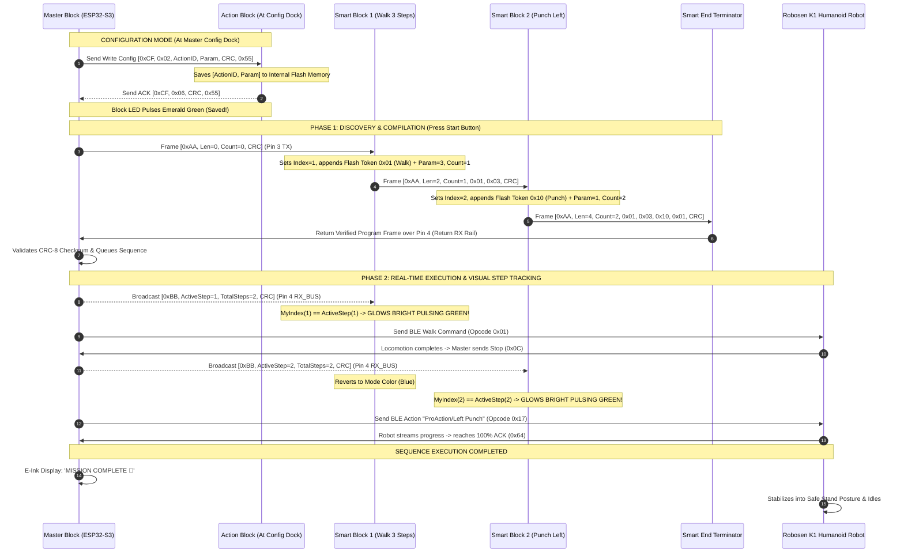

# Robosen Tangible Coding Block System & RobosenJS SDK

> **Physical Tangible Modular Coding Block System & Multi-Platform SDK for the Robosen K1 Humanoid Robot**  
> Designed for Screenless STEM Learning for Young Children ($\le 7$ Years Old) and Advanced Robotics Developers.  
> **FCC ID:** `2ATNWK1` | **Live Verified Robot ID:** `K1-00457` (`3C:A5:51:94:97:70`) | **Firmware:** `VER:3.03L`

---

## 📑 Table of Contents

1. [Executive Overview & Educational Mission](#-executive-overview--educational-mission)
2. [System Architecture & Signal Flow](#-system-architecture--signal-flow)
3. [2-Phase Bi-Directional Bus Protocol (CRC-8)](#-2-phase-bi-directional-bus-protocol-crc-8)
4. [Python Native BLE Subsystem & Daemon](#-python-native-ble-subsystem--daemon)
5. [Hardware & Electrical Specifications](#-hardware--electrical-specifications)
6. [Project Documentation Sitemap](#-project-documentation-sitemap)
7. [Developer Guide & Upstream RobosenJS SDK](#-developer-guide--upstream-robosenjs-sdk)

---

## 🎯 Executive Overview & Educational Mission

### The Core Problem
Most modern coding curricula for children rely on tablets, smartphones, or computers (e.g., Scratch, Blockly). However, for **young children aged 7 and under** (Piaget’s Preoperational and early Concrete Operational stages), screens present significant developmental hurdles:
- **Abstract vs. Concrete Cognition:** Young children learn best through tactile, physical manipulation rather than abstract 2D screen coordinates.
- **Screen Fatigue & Distraction:** Excessive screen time causes disengagement, eye strain, and cognitive overload.
- **Disconnected Output:** Virtual sprites on screens lack the visceral spatial feedback and excitement of watching a physical bipedal robot walk, punch, balance, and cheer.

### The Tangible Coding Solution
This project creates a **tangible, screenless, modular physical block programming system**. Children configure solid coding blocks on the Master's **Config Dock**, then snap them together in a line to create an algorithmic sequence at the **Run Port**. When they press the big **Green "Start" Button** on the Master Block, the sequence compiles instantly, verifies checksums, commands the **Robosen K1 humanoid robot** via Bluetooth Low Energy (BLE), and lights up each physical block with a **bright pulsating green LED** in real time as the robot executes each step!

```text
┌──────────────────────────────────────────────────────────────────────────────────────────────────┐
│                                   PHYSICAL TANGIBLE CODING CHAIN                                 │
│                                                                                                  │
│   [ MASTER BLOCK ] ──► [ WALK BLOCK ] ──► [ TURN BLOCK ] ──► [ PUNCH BLOCK ] ──► [ END BLOCK ]   │
│   (Brain, Battery,     (Param: 3 steps)   (Param: 90° Right) (Action: Left Hook) (Terminator)    │
│    E-Ink Display,                                                                                │
│    2 Config Knobs,                                                                               │
│    Start Button)                                                                                 │
│          │                                                                                       │
│          ▼ (Bluetooth BLE 4.2 / 5.0 Stream)                                                      │
│   [ ROBOSEN K1 HUMANOID ROBOT ] ─── Executes commands step-by-step with real-time feedback!      │
└──────────────────────────────────────────────────────────────────────────────────────────────────┘
```

---

## ⚡ System Architecture & Signal Flow

### 1. Dual-Mode Hardware Bus & Port Architecture


### 2. Config Mode: Flash Programming & Data Flow


### 3. Run Mode: End-to-End Execution & Protocol Data Flow


The system operates across three interconnected layers:
1. **Physical Modular Block Bus (4-Pin Magnetic Interface):** Master Block (ESP32-S3 with E-Ink & Config Dock) $\longleftrightarrow$ Solid Smart Blocks (WCH CH32V003 RISC-V) $\longleftrightarrow$ Smart End Block.
2. **Master Embedded & Control Gateway:** Master ESP32-S3 coordinates discovery frames (`0xAA`), CRC-8 validation, step broadcasts (`0xBB`), and non-blocking BLE command dispatch.
3. **Hardware Gateway & Robot Layer (Python BLE Daemon & Robosen K1):** Persistent BLE connection to Robosen K1 with dynamic 100% action completion ACK resolution.



---

## 📡 2-Phase Bi-Directional Bus Protocol (CRC-8)

To achieve native physical order auto-discovery, hot-plug resilience, and real-time visual feedback over a simple 4-pin magnetic connector, the system uses an **Enhanced 2-Phase Bi-Directional UART Protocol**:

### Standardized 4-Pin Pogo Connector Pinout
* **Pin 1 (`V+`):** Regulated 3.3V power rail supplied by Master Block.
* **Pin 2 (`GND`):** Common system ground.
* **Pin 3 (`UART TX_DOWN`):** Downstream point-to-point serial line (Master $\to$ Block 1 $\to$ Block 2 $\dots \to$ End).
* **Pin 4 (`UART RX_BUS`):** Continuous return rail & real-time step broadcast bus.

### Binary Frame Structures
All serial transmissions use binary frames protected by **CRC-8** (Polynomial: $x^8 + x^2 + x + 1$, `0x07`):

1. **Phase 1: Discovery & Compilation Frame (`Header = 0xAA`)**
   ```
   [ 0xAA ] [ PacketLen (N) ] [ BlockCount (K) ] [ Block 1 ID ] [ Param 1 ] ... [ CRC-8 ] [ 0x55 ]
   ```
2. **Phase 2: Live Step Broadcast Frame (`Header = 0xBB`)**
   ```
   [ 0xBB ] [ ActiveStep (1-N / 0xFF) ] [ TotalSteps (N) ] [ CRC-8 ] [ 0x55 ]
   ```

### Command Token Catalog & LED Color Mapping

| Token ID | Command Name | Parameter | Robosen BLE Mapping | LED Color |
| :---: | :--- | :--- | :--- | :---: |
| `0x01` | `MOVE_FORWARD` | Steps (`1`–`10`) | `0x01` (Walk Forward) | 🔵 Blue (`#1E88E5`) |
| `0x02` | `MOVE_BACKWARD`| Steps (`1`–`10`) | `0x05` (Walk Backward) | 🔵 Dark Blue (`#1565C0`) |
| `0x03` | `TURN_LEFT` | Angle (`45°`–`180°`) | `0x08` (Turn Left) | 🔷 Cyan (`#00ACC1`) |
| `0x04` | `TURN_RIGHT` | Angle (`45°`–`180°`) | `0x02` (Turn Right) | 🔷 Cyan (`#00ACC1`) |
| `0x07` | `MOVE_LEFT` | Side-steps (`1`–`5`)| `0x07` (Step Left) | 🟦 Sky Blue (`#039BE5`) |
| `0x08` | `MOVE_RIGHT` | Side-steps (`1`–`5`)| `0x03` (Step Right) | 🟦 Sky Blue (`#039BE5`) |
| `0x10` | `LEFT_PUNCH` | Style (`1`–`3`) | `0x17` (`"ProAction/Left Punch"`) | 🔴 Red (`#E53935`) |
| `0x11` | `RIGHT_PUNCH`| Style (`1`–`3`) | `0x17` (`"ProAction/Right Punch"`) | 🔴 Bright Red (`#D32F2F`) |
| `0x12` | `KUNG_FU` | Routine Variant | `0x17` (`"ProAction/Kung Fu"`) | 🟠 Orange (`#FB8C00`) |
| `0x13` | `BOOGALOO` | Style Variant | `0x17` (`"Action/Boogaloo"`) | 🟣 Magenta (`#8E24AA`) |
| `0x14` | `PUSH_UPS` | Repetitions (`1`–`3`)| `0x17` (`"ProAction/Push Ups"`) | 🟤 Brown (`#6D4C41`) |
| `0x15` | `HANDSTAND` | Duration Hold | `0x17` (`"ProAction/Handstand"`) | 🟤 Brown (`#6D4C41`) |
| `0x16` | `SINGLE_KICK`| Kick Type | `0x17` (`"ProAction/Left Kick"`) | 🔴 Red (`#E53935`) |
| `0x17` | `DO_SQUATS` | Repetitions (`1`–`3`)| `0x17` (`"ProAction/Do Squats"`) | 🟢 Green (`#43A047`) |
| `0x18` | `SAY_HELLO` | Greeting Style | `0x17` (`"ProAction/Say Hello"`) | 🩵 Teal (`#00897B`) |
| `0x19` | `CELEBRATE` | Cheer Style | `0x17` (`"ProAction/Celebrate"`) | 🟡 Yellow (`#FDD835`) |
| `0x20` | `HEAD_MOVE` | Pan Angle (`42`–`202`)| `0xE8` (Servo index 16) | 🩵 Teal (`#00897B`) |
| `0x30` | `WAIT_DELAY` | Seconds (`1`–`5`s) | Master sleep delay timer | 🟡 Yellow (`#FBC02D`) |
| `0x40` | `REPEAT_LOOP`| Iterations (`2x`–`5x`)| Master sub-queue loop | 🟢 Lime (`#7CB342`) |

---

## 🐍 Python Native BLE Subsystem & Daemon

To provide 100% reliable Bluetooth Low Energy communication on Windows 11/10 without requiring C++ MSVC compiler toolchains, the project includes a native Python BLE subsystem powered by `bleak` and Windows WinRT:

### 1. Persistent BLE Daemon ([`scripts/k1_ble_daemon.py`](scripts/k1_ble_daemon.py))
- **Persistent Long-Lived Connection:** Connects once on startup and keeps the BLE connection alive to eliminate reconnection latency.
- **Dynamic 100% Action Completion ACK:** Listens to BLE Characteristic `0xFFE1` notifications in real time. Actions resolve the exact millisecond the physical robot emits `action_progress: 100%` (`0x64`), allowing seamless back-to-back chaining without hardcoded delays.
- **Standing Posture Preservation (`move_head_only`):** Captures live standing angles of all 16 body/leg servos via `0xE9` (`jointSync`) so neck/head articulations rotate smoothly without snapping leg angles or causing balance loss.
- **Bidirectional JSON IPC:** Communicates over `stdin`/`stdout` with Node-RED and CLI tools.

### 2. Fast Command-Line Execution CLI ([`scripts/k1_action.py`](scripts/k1_action.py))
```powershell
# Query Live Telemetry & Battery
python scripts/k1_action.py status

# Locomotion Steps
python scripts/k1_action.py walk
python scripts/k1_action.py turn_left
python scripts/k1_action.py turn_right

# Martial Arts & Combat
python scripts/k1_action.py punch_left
python scripts/k1_action.py punch_right
python scripts/k1_action.py kung_fu
python scripts/k1_action.py single_kick

# Stunts, Acrobatics & Dances
python scripts/k1_action.py push_ups
python scripts/k1_action.py handstand
python scripts/k1_action.py boogaloo
python scripts/k1_action.py say_hello
python scripts/k1_action.py celebrate
python scripts/k1_action.py do_squats

# Head Servo Articulations & Posture
python scripts/k1_action.py default_stand
python scripts/k1_action.py head_left
python scripts/k1_action.py head_right
python scripts/k1_action.py head_center
python scripts/k1_action.py head_pan
```

### 3. Interactive Joint Kinematics Controller ([`scripts/k1_joint_controller.py`](scripts/k1_joint_controller.py))
Interactive keyboard controller for all 17 digital servos with real-time safeguard limit enforcement, visual gauges, and error handling:
```powershell
python scripts/k1_joint_controller.py
```
- **Connection:** `C` (Connect/Reconnect) / `D` (Disconnect cleanly)
- **Select Joint:** `↑` / `↓` or `[` / `]` or Number `0`–`9`
- **Adjust Value:** `←` / `→` (or `PageDown` / `PageUp` for ±10)
- **Step Size:** `+` / `-` (1, 2, 5, 10)
- **Reset:** `R` (active joint) / `Shift+R` (all 17 stand pose)
- **Torque:** `U` (free joints for manual posing) / `L` (lock holding torque)

### 4. Interactive Telemetry & Control Suite ([`scripts/k1_ble_tester.py`](scripts/k1_ble_tester.py))
```powershell
python scripts/k1_ble_tester.py
```

---

## 🛠️ Hardware & Electrical Specifications

Complete hardware specifications are detailed in [`PHYSICAL_BLOCK_SYSTEM_SPEC.md`](PHYSICAL_BLOCK_SYSTEM_SPEC.md) and [`PROTOTYPE_01_SPEC.md`](PROTOTYPE_01_SPEC.md):

### 1. Master Controller Breadboard Wiring & Pinout (Prototype #01)

```text
  (+) Red Rail  (+3.3V) ◄═════════[ 🔴 RED ]════════ ESP32 3V3 Pin
  (-) Blue Rail (GND)   ◄═════════[ ⚫ BLACK ]══════ ESP32 GND Pin

  [ KNOB 1: KY-040 Action Selector ]
   • VCC / +  ──► [ 🔴 RED ]    ──► (+) 3.3V Power Rail
   • GND      ──► [ ⚫ BLACK ]  ──► (-) Ground Rail
   • CLK      ──► [ 🟡 YELLOW ] ──► ESP32 GPIO 8
   • DT       ──► [ 🟢 GREEN ]  ──► ESP32 GPIO 9
   • SW       ──► [ 🔵 BLUE ]   ──► ESP32 GPIO 10

  [ KNOB 2: KY-040 Parameter Adjuster ]
   • VCC / +  ──► [ 🔴 RED ]    ──► (+) 3.3V Power Rail
   • GND      ──► [ ⚫ BLACK ]  ──► (-) Ground Rail
   • CLK      ──► [ ⚪ WHITE ]  ──► ESP32 GPIO 11 (CW = Increase)
   • DT       ──► [ 🟤 BROWN ]  ──► ESP32 GPIO 12
   • SW       ──► [ 🔘 GRAY ]   ──► ESP32 GPIO 13

  [ Tactile Start / Confirm Button - Green (4-Pin DIP, SW3) ]
   • Top-Right Pin ──► [ 🟠 ORANGE ] ──► ESP32 GPIO 14 (Internal Pull-Up)
   • Bottom-Left   ──► [ ⚫ BLACK ]  ──► (-) Ground Rail (Diagonal GND Return)

  [ Tactile Cancel / Stop Button - Red (4-Pin DIP, SW5) ]
   • Top-Right Pin ──► [ 🔴 RED/ORANGE ] ──► ESP32 GPIO 2 (Internal Pull-Up)
   • Bottom-Left   ──► [ ⚫ BLACK ]       ──► (-) Ground Rail (Diagonal GND Return)

  [ Battery Voltage Monitoring Divider (ADC1_CH0) ]
   • Divider Top   ──► VBAT_SW (Switched Battery Voltage Rail)
   • Midpoint (Sense)──► ESP32 GPIO 1 (BATSENSE) with 100nF Ceramic Filter Cap to GND
   • Divider Bottom──► (-) Ground Rail
```

| Component / Function | ESP32-S3 GPIO | Wire Color | Role / Description | Status |
| :--- | :---: | :---: | :--- | :---: |
| **+3.3V Power Rail** | `3V3` | 🔴 **Red** | Unified 3.3V DC Power Bus | ✅ Verified |
| **GND Common Rail** | `GND` | ⚫ **Black** | Common Ground Bus | ✅ Verified |
| **Battery Sense (ADC)** | `GPIO 1` | — | ADC1_CH0 1:1 Divider (100k/100k + 100nF) | ✅ Hardware Implemented |
| **Stop / Cancel Button**| `GPIO 2` | 🔴 **Red** | Red Tactile Button (`SW5`): Emergency Stop / Cancel / Back | ✅ Hardware Implemented |
| **Start / Run Button** | `GPIO 14` | 🟢/🟠 **Green/Orange**| Green Tactile Button (`SW3`): Confirm / Start / Next | ✅ Verified |
| **Knob 1 CLK** | `GPIO 8` | 🟡 **Yellow** | Action Selection Direction A | ✅ Verified |
| **Knob 1 DT** | `GPIO 9` | 🟢 **Green** | Action Selection Direction B | ✅ Verified |
| **Knob 1 SW** | `GPIO 10` | 🔵 **Blue** | Action Select Confirmation | ✅ Verified |
| **Knob 2 CLK** | `GPIO 11` | ⚪ **White** | Parameter Adjust Clock (CW = +) | ✅ Verified |
| **Knob 2 DT** | `GPIO 12` | 🟤 **Brown** | Parameter Adjust Data | ✅ Verified |
| **Knob 2 SW** | `GPIO 13` | 🔘 **Gray** | Parameter Reset / BLE Save | ✅ Verified |
| **Onboard Status RGB** | `GPIO 48` | *Internal* | 🟢 Ready \| 🔵 Scan \| 🟡 TX | ✅ Verified |
| **Config Dock UART** | `GPIO 17, 18` | 🔘 Gray / 🟣 Purple | Write Action (`0xCF`) & Read ACK | ✅ Verified |
| **Run Chain Bus UART**| `GPIO 15, 16` | 🟢 Green / ⚪ White | Phase 1 Discovery (`0xAA`) & Run (`0xBB`)| ✅ Verified |
| **E-Ink Display (SPI)** | `GPIO 4,5,6,7,21,38`| — | 2.13" DEPG0213BN SSD1680 (746ms Partial, Zero-Flicker Boot) | ✅ Verified |

### 2. Block Hardware Specifications
- **Master Block MCU:** ESP32-S3 (Dual-Core Xtensa LX7, Native Bluetooth BLE 5.0, SPI for E-Ink, and Dual UARTs for Config Dock & Run Chain).
- **Master UI & Display:** 2.13" E-Ink E-Paper display (DEPG0213BN / SSD1680, $71 \times 30\text{ mm}$ outline) + Dual Rotary Dials (Action & Parameter) + Dual Tactile Buttons (Green Start/Confirm & Red Stop/Cancel) + Battery Sense Monitor.
- **Visual Feedback (No Buzzer):** Master & Block WS2812B RGB LEDs with rich light choreography (emerald green flash ACK, data comet compilation wave, live step glowing green, rainbow victory sparkle).
- **Solid Action Block MCUs:** Ultra-low-cost WCH CH32V003 (32-bit RISC-V, ~$0.15 in SOP-8 package) with internal non-volatile flash parameter storage. No potentiometers or buttons on individual blocks!
- **Power & Charging:** Single 18650 3.7V Li-ion cell with onboard TP4056 USB-C charging, BMS protection, and TPS63020 3.3V synchronous buck-boost regulator.
- **Physical Connector:** Standardized 4-pin polarized magnetic pogo connector with reverse-polarity protection and RC debouncing filters.

### 3. Firmware Deliverables & Hardware Verification

| Module | Hardware Target | Source Location | Description | Status |
| :--- | :--- | :--- | :--- | :---: |
| **Master Controller** | ESP32-S3 | [`firmware/esp32_master/`](firmware/esp32_master/) | BLE Central, NVS pairing, Dual-Knob UI, Run Chain Engine (`0xAA`/`0xBB`) | ⚠️ **Update Pending** (Add Red Button `GPIO2` & Battery Sense `GPIO1`) |
| **Standalone E-Ink Test** | ESP32-S3 | [`firmware/standalone_eink_test/`](firmware/standalone_eink_test/) | 2.13" E-Paper DEPG0213BN driver, zero-flicker boot, live partial benchmark (1.34 Hz) | ✅ Verified |
| **Action Block Firmware** | WCH CH32V003 | [`firmware/ch32v003_action_block/`](firmware/ch32v003_action_block/) | Unified C RISC-V firmware (2-Phase Binary V2, Config Dock, WS2812B) | ✅ **Flashed on Silicon** |
| **Smart End Block Firmware** | WCH CH32V003 | [`firmware/ch32v003_end_block/`](firmware/ch32v003_end_block/) | Active loopback line driver, CRC-8 validation, rainbow sparkle (`0xEE`) | ✅ **Flashed on Silicon** |
| **ESP32 SWIO Programmer** | ESP32 / ESP32-S3 | [`firmware/esp32_ch32v003_programmer/`](firmware/esp32_ch32v003_programmer/) | High-speed 1-wire SWIO debugger & chunked Python flasher (`flash_tool.py`) | ✅ Verified |
| **Arduino Uno Programmer** | Arduino Uno R3 | [`firmware/arduino_uno_ch32v003_programmer/`](firmware/arduino_uno_ch32v003_programmer/) | Ardulink 16MHz assembly bit-banging flasher for `minichlink` | ✅ Verified |
| **Master Carrier PCB** | KiCad 10.0.6 | [`hardware/master_block/`](hardware/master_block/) | Custom carrier motherboard PCB project, 12 verified footprints (`robosen_master.pretty`), 0 ERC violations | ✅ **Ordered** |
| **Action Block PCB** | KiCad 10.0.6 | [`hardware/action_block/`](hardware/action_block/) | 32×32mm modular action block carrier, centered pogo docks, 3-pin RGB header, 0 DRC violations | ✅ **Ordered** |

---

## 📚 Project Documentation Sitemap

| Document | Description |
| :--- | :--- |
| [`docs/master_block_wiring.html`](docs/master_block_wiring.html) | Interactive Master Block BOM, color-coded pinout wiring table, and battery circuit guide |
| [`hardware/master_block/`](hardware/master_block/) | KiCad 10 Master Block PCB project, footprint library, and JLCPCB manufacturing checklist |
| [`hardware/action_block/`](hardware/action_block/) | KiCad 10 Action Block PCB project, routing report, and production Gerbers |
| [`PROJECT_SUMMARY.md`](PROJECT_SUMMARY.md) | Comprehensive executive project summary, mission, and comparison matrix |
| [`PHYSICAL_BLOCK_SYSTEM_SPEC.md`](PHYSICAL_BLOCK_SYSTEM_SPEC.md) | Hardware, electrical, connector pinout, and 2-phase protocol specifications |
| [`PROTOTYPE_01_SPEC.md`](PROTOTYPE_01_SPEC.md) | Prototype 01 hardware breadboard wiring, firmware, and test guides |
| [`IMPROVEMENT_PLAN.md`](IMPROVEMENT_PLAN.md) | 5-Pillar Master Improvement Plan and future production roadmap |
| [`MEMORY.md`](MEMORY.md) | Master technical knowledge base, verified hardware diagnostics, and opcode catalog |
| [`ROBOSEN_K1_DOCUMENTATION.md`](ROBOSEN_K1_DOCUMENTATION.md) | Official Robosen K1 reference manual, kinematics, voice commands, and safety guide |
| [`docs/K1_HARDWARE_AUDIT_REPORT.md`](docs/K1_HARDWARE_AUDIT_REPORT.md) | Live physical robot hardware diagnostics, telemetry verification, and action catalog dump |

---

## 💻 Developer Guide & Upstream RobosenJS SDK

### Getting Started (Node.js SDK)
- Requires [Node.js](https://nodejs.org/en/download) (v22+)
- Install dependencies: `npm install`
- Run linting: `npm run lint`

### Programming API (JavaScript / TypeScript)
```js
import { K1 } from "robosen-js";

const k1 = new K1();
await k1.on();
await k1.volume(100);
await k1.autoStand(false);
await k1.moveForward();
await k1.leftPunch();
await k1.headLeft();
await k1.leftHand("+40%", 30);
await k1.audio("AppSysMS/101");
await k1.wait(3000);
await k1.end();
```

### CLI Utilities
```powershell
# Interactive REPL
npm run k1:repl

# Gamepad / Keyboard Controller
npm run k1:control

# Natural Language LLM Prompt (Requires OPENAI_API_KEY)
npm run k1:prompt
```

---

## 📄 License & Attribution

This project is licensed under the **[Apache License 2.0](LICENSE)**.

- **Original Base Library:** Core reverse-engineered protocol parser derived from [RobosenJS](https://github.com/oklemenz/RobosenJS) by Oliver Klemenz (Apache-2.0 License).
- **Physical Modular Tangible Coding Blocks:** Hardware specifications (CH32V003 bus, TP4056 power management) and 2-phase binary protocol with CRC-8 developed by [Nantaphat Yoktaworn](https://github.com/Nantaphat-Yoktaworn).
- **Python Subsystem:** Native background BLE daemon, IPC bridge, and interactive joint safeguard controller developed by [Nantaphat Yoktaworn](https://github.com/Nantaphat-Yoktaworn).
- **Trademarks:** Robosen is a registered trademark of Robosen Robotics. This open-source project is independently developed and not officially affiliated with or endorsed by Robosen.

