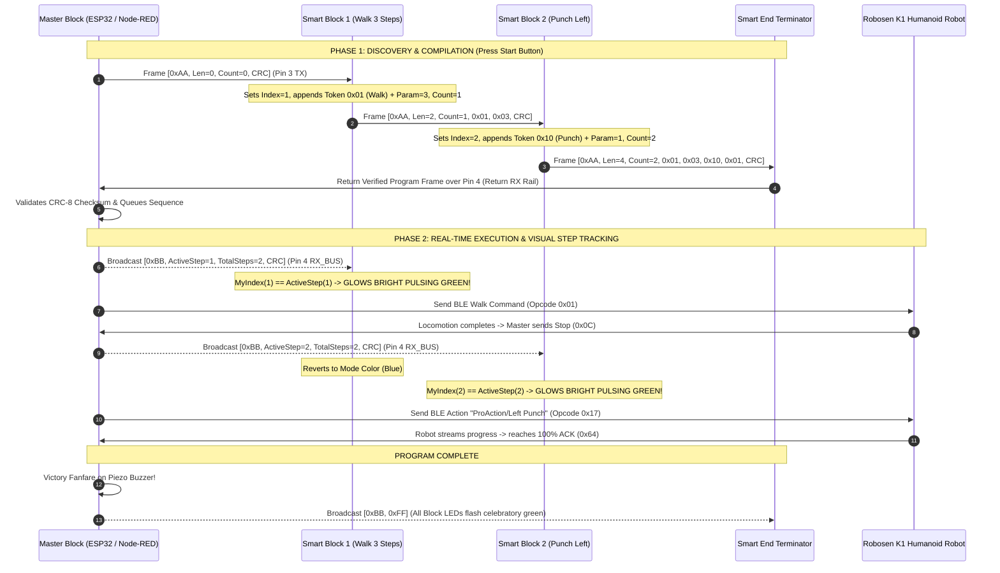

# Robosen Tangible Coding Block System & RobosenJS SDK

> **Physical Tangible Modular Coding Block System & Multi-Platform SDK for the Robosen K1 Humanoid Robot**  
> Designed for Screenless STEM Learning for Young Children ($\le 7$ Years Old) and Advanced Robotics Developers.  
> **FCC ID:** `2ATNWK1` | **Live Verified Robot ID:** `K1-00457` (`3C:A5:51:94:97:70`) | **Firmware:** `VER:3.03L`

---

## 📑 Table of Contents

1. [Executive Overview & Educational Mission](#-executive-overview--educational-mission)
2. [System Architecture & Signal Flow](#-system-architecture--signal-flow)
3. [2-Phase Bi-Directional Bus Protocol (CRC-8)](#-2-phase-bi-directional-bus-protocol-crc-8)
4. [Node-RED Custom Palette (`node-red-contrib-robosen-block` v2.0)](#-node-red-custom-palette-node-red-contrib-robosen-block-v20)
5. [Python Native BLE Subsystem & Daemon](#-python-native-ble-subsystem--daemon)
6. [Hardware & Electrical Specifications](#-hardware--electrical-specifications)
7. [Academic Research & Pedagogical Foundation](#-academic-research--pedagogical-foundation)
8. [Project Documentation Sitemap](#-project-documentation-sitemap)
9. [Developer Guide & Upstream RobosenJS SDK](#-developer-guide--upstream-robosenjs-sdk)

---

## 🎯 Executive Overview & Educational Mission

### The Core Problem
Most modern coding curricula for children rely on tablets, smartphones, or computers (e.g., Scratch, Blockly). However, for **young children aged 7 and under** (Piaget’s Preoperational and early Concrete Operational stages), screens present significant developmental hurdles:
- **Abstract vs. Concrete Cognition:** Young children learn best through tactile, physical manipulation rather than abstract 2D screen coordinates.
- **Screen Fatigue & Distraction:** Excessive screen time causes disengagement, eye strain, and cognitive overload.
- **Disconnected Output:** Virtual sprites on screens lack the visceral spatial feedback and excitement of watching a physical bipedal robot walk, punch, balance, and cheer.

### The Tangible Coding Solution
This project creates a **tangible, screenless, modular physical block programming system**. Children physically snap together magnetic coding blocks in a line to create an algorithmic sequence. When they press the big **Green "Start" Button** on the Master Block, the sequence compiles instantly, verifies checksums, commands the **Robosen K1 humanoid robot** via Bluetooth Low Energy (BLE), and lights up each physical block with a **bright pulsating green LED** in real time as the robot executes each step!

```
┌──────────────────────────────────────────────────────────────────────────────────────────────────┐
│                                   PHYSICAL TANGIBLE CODING CHAIN                                 │
│                                                                                                  │
│   [ MASTER BLOCK ] ──► [ WALK BLOCK ] ──► [ TURN BLOCK ] ──► [ PUNCH BLOCK ] ──► [ END BLOCK ]   │
│   (Brain, Battery,     (Param: 3 steps)   (Param: 90° Right) (Action: Left Hook) (Terminator)    │
│    Start Button,                                                                                 │
│    Buzzer Chime)                                                                                 │
│          │                                                                                       │
│          ▼ (Bluetooth BLE 4.2 Stream)                                                            │
│   [ ROBOSEN K1 HUMANOID ROBOT ] ─── Executes commands step-by-step with real-time feedback!      │
└──────────────────────────────────────────────────────────────────────────────────────────────────┘
```

---

## ⚡ System Architecture & Signal Flow

The system operates across three interconnected layers:
1. **Physical Modular Block Bus (4-Pin Magnetic Interface):** Master Block (ESP32) $\longleftrightarrow$ Smart Blocks (WCH CH32V003 RISC-V) $\longleftrightarrow$ Smart End Block.
2. **Simulation & Orchestration Layer (Node-RED v2.0):** Custom palette simulating hardware blocks, serial bus signals, protocol validation, and execution queues.
3. **Hardware Gateway & Robot Layer (Python BLE Daemon & Robosen K1):** Persistent BLE connection to Robosen K1 with dynamic 100% action completion ACK resolution.



---

## 📡 2-Phase Bi-Directional Bus Protocol (CRC-8)

To achieve native physical order auto-discovery, hot-plug resilience, and real-time visual feedback over a simple 4-pin magnetic connector, the system uses an **Enhanced 2-Phase Bi-Directional UART Protocol**:

### Standardized 4-Pin Pogo Connector Pinout
* **Pin 1 (`V+`):** Regulated 3.3V power rail supplied by Master Block.
* **Pin 2 (`GND`):** Common system ground.
* **Pin 3 (`UART TX_DOWN`):** Downstream point-to-point serial line (Master $\to$ Block 1 $\to$ Block 2 $\dots \to$ End).
* **Pin 4 (`UART RX_BUS`):** Continuous return rail & real-time step broadcast bus.

### Binary Frame Structures
All serial transmissions use binary frames protected by **CRC-8** (Polynomial: $x^8 + x^2 + x + 1$, `0x07`):

1. **Phase 1: Discovery & Compilation Frame (`Header = 0xAA`)**
   ```
   [ 0xAA ] [ PacketLen (N) ] [ BlockCount (K) ] [ Block 1 ID ] [ Param 1 ] ... [ CRC-8 ] [ 0x55 ]
   ```
2. **Phase 2: Live Step Broadcast Frame (`Header = 0xBB`)**
   ```
   [ 0xBB ] [ ActiveStep (1-N / 0xFF) ] [ TotalSteps (N) ] [ CRC-8 ] [ 0x55 ]
   ```

### Command Token Catalog & LED Color Mapping

| Token ID | Command Name | Parameter | Robosen BLE Mapping | LED Color |
| :---: | :--- | :--- | :--- | :---: |
| `0x01` | `MOVE_FORWARD` | Steps (`1`–`10`) | `0x01` (Walk Forward) | 🔵 Blue (`#1E88E5`) |
| `0x02` | `MOVE_BACKWARD`| Steps (`1`–`10`) | `0x05` (Walk Backward) | 🔵 Dark Blue (`#1565C0`) |
| `0x03` | `TURN_LEFT` | Angle (`45°`–`180°`) | `0x08` (Turn Left) | 🔷 Cyan (`#00ACC1`) |
| `0x04` | `TURN_RIGHT` | Angle (`45°`–`180°`) | `0x02` (Turn Right) | 🔷 Cyan (`#00ACC1`) |
| `0x07` | `MOVE_LEFT` | Side-steps (`1`–`5`)| `0x07` (Step Left) | 🟦 Sky Blue (`#039BE5`) |
| `0x08` | `MOVE_RIGHT` | Side-steps (`1`–`5`)| `0x03` (Step Right) | 🟦 Sky Blue (`#039BE5`) |
| `0x10` | `LEFT_PUNCH` | Style (`1`–`3`) | `0x17` (`"ProAction/Left Punch"`) | 🔴 Red (`#E53935`) |
| `0x11` | `RIGHT_PUNCH`| Style (`1`–`3`) | `0x17` (`"ProAction/Right Punch"`) | 🔴 Bright Red (`#D32F2F`) |
| `0x12` | `KUNG_FU` | Routine Variant | `0x17` (`"ProAction/Kung Fu"`) | 🟠 Orange (`#FB8C00`) |
| `0x13` | `BOOGALOO` | Style Variant | `0x17` (`"Action/Boogaloo"`) | 🟣 Magenta (`#8E24AA`) |
| `0x14` | `PUSH_UPS` | Repetitions (`1`–`3`)| `0x17` (`"ProAction/Push Ups"`) | 🟤 Brown (`#6D4C41`) |
| `0x15` | `HANDSTAND` | Duration Hold | `0x17` (`"ProAction/Handstand"`) | 🟤 Brown (`#6D4C41`) |
| `0x16` | `SINGLE_KICK`| Kick Type | `0x17` (`"ProAction/Left Kick"`) | 🔴 Red (`#E53935`) |
| `0x17` | `DO_SQUATS` | Repetitions (`1`–`3`)| `0x17` (`"ProAction/Do Squats"`) | 🟢 Green (`#43A047`) |
| `0x18` | `SAY_HELLO` | Greeting Style | `0x17` (`"ProAction/Say Hello"`) | 🩵 Teal (`#00897B`) |
| `0x19` | `CELEBRATE` | Cheer Style | `0x17` (`"ProAction/Celebrate"`) | 🟡 Yellow (`#FDD835`) |
| `0x20` | `HEAD_MOVE` | Pan Angle (`42`–`202`)| `0xE8` (Servo index 16) | 🩵 Teal (`#00897B`) |
| `0x30` | `WAIT_DELAY` | Seconds (`1`–`5`s) | Master sleep delay timer | 🟡 Yellow (`#FBC02D`) |
| `0x40` | `REPEAT_LOOP`| Iterations (`2x`–`5x`)| Master sub-queue loop | 🟢 Lime (`#7CB342`) |

---

## 🎛️ Node-RED Custom Palette (`node-red-contrib-robosen-block` v2.0)

A comprehensive Node-RED node suite located at [`node-red-contrib-robosen-block/`](node-red-contrib-robosen-block/):

```
node-red-contrib-robosen-block/
├── lib/
│   └── protocol.js                       # Protocol encoder, decoder, CRC-8, and token catalog
├── nodes/
│   ├── robosen-master.js / .html         # Smart Master Block controller (2-Phase Binary V2)
│   ├── robosen-legacy-master.js / .html  # Dedicated Legacy Master Block (CSV String V1)
│   ├── robosen-smart-block.js / .html    # Smart Multi-Action Block (CH32V003) with button & knob
│   ├── robosen-smart-end.js / .html      # Active Smart End Terminator with CRC validation
│   ├── robosen-protocol-monitor.js / .html # Serial Protocol Analyzer & Packet Sniffer
│   ├── robosen-tester.js / .html         # Standalone Action Tester & Direct Controller
│   ├── robosen-instruction.js / .html    # Legacy 1-action block (V1)
│   └── robosen-end.js / .html            # Legacy passive loopback terminator (V1)
├── examples/
│   ├── robosen_smart_block_flow.json     # Ready-to-import 2-Phase Smart Block simulation flow
│   └── robosen_simulator_flow.json       # Legacy string simulation flow
├── package.json                          # Palette metadata (v2.0.0)
└── README.md                             # Palette user guide & API documentation
```

### Palette Nodes Overview:
1. **`robosen-master` (Smart Master Block Controller - V2):**
   - Clickable start button emits Phase 1 seed frame (`0xAA`) on Pin 3 TX (Output 1).
   - Verifies CRC-8 on Pin 4 Return RX (Input 1), coordinates BLE execution queue, and broadcasts Phase 2 execution frames (`0xBB`) on Pin 4 (Output 3).
   - Contains live properties dashboard card with robot status, battery level, firmware version, and manual controls.
2. **`robosen-legacy-master` (Legacy Master Block - V1):**
   - Dedicated master controller for non-smart blocks.
   - Emits `"start"` string, collects CSV tokens, and runs sequence on Robosen K1 via persistent BLE.
3. **`robosen-smart-block` (Smart Multi-Action Block):**
   - Simulates the CH32V003 RISC-V smart block.
   - Interactive push-button cycles actions; rotary knob adjusts parameters.
   - Illuminates **bright pulsating green** during active step execution.
4. **`robosen-smart-end` (Smart Active Terminator):**
   - Validates CRC-8 checksum, appends `0x55` framing footer, and loops signal back to Pin 4 Return RX rail.
   - Includes fault injection toggle to simulate CRC corruption for error testing.
5. **`robosen-protocol-monitor` (Bus Analyzer & Packet Inspector):**
   - Sniffs serial frames on the bus in real time.
   - Displays raw hex bytes, decoded tokens, parameter values, and CRC integrity status.
6. **`robosen-tester` (Direct Controller & Tester):**
   - Standalone testing node for one-click action triggering and live battery monitoring.

### Import Simulation Flow in Node-RED:
1. Open Node-RED (`http://127.0.0.1:1880`).
2. Click **Menu** $\to$ **Import** $\to$ Select [`node-red-contrib-robosen-block/examples/robosen_smart_block_flow.json`](node-red-contrib-robosen-block/examples/robosen_smart_block_flow.json).
3. Click **Deploy**.
4. Click the button on the **Master Block** to watch the sequence compile and run!

---

## 🐍 Python Native BLE Subsystem & Daemon

To provide 100% reliable Bluetooth Low Energy communication on Windows 11/10 without requiring C++ MSVC compiler toolchains, the project includes a native Python BLE subsystem powered by `bleak` and Windows WinRT:

### 1. Persistent BLE Daemon ([`scripts/k1_ble_daemon.py`](scripts/k1_ble_daemon.py))
- **Persistent Long-Lived Connection:** Connects once on startup and keeps the BLE connection alive to eliminate reconnection latency.
- **Dynamic 100% Action Completion ACK:** Listens to BLE Characteristic `0xFFE1` notifications in real time. Actions resolve the exact millisecond the physical robot emits `action_progress: 100%` (`0x64`), allowing seamless back-to-back chaining without hardcoded delays.
- **Standing Posture Preservation (`move_head_only`):** Captures live standing angles of all 16 body/leg servos via `0xE9` (`jointSync`) so neck/head articulations rotate smoothly without snapping leg angles or causing balance loss.
- **Bidirectional JSON IPC:** Communicates over `stdin`/`stdout` with Node-RED and CLI tools.

### 2. Fast Command-Line Execution CLI ([`scripts/k1_action.py`](scripts/k1_action.py))
```powershell
# Query Live Telemetry & Battery
python scripts/k1_action.py status

# Locomotion Steps
python scripts/k1_action.py walk
python scripts/k1_action.py turn_left
python scripts/k1_action.py turn_right

# Martial Arts & Combat
python scripts/k1_action.py punch_left
python scripts/k1_action.py punch_right
python scripts/k1_action.py kung_fu
python scripts/k1_action.py single_kick

# Stunts, Acrobatics & Dances
python scripts/k1_action.py push_ups
python scripts/k1_action.py handstand
python scripts/k1_action.py boogaloo
python scripts/k1_action.py say_hello
python scripts/k1_action.py celebrate
python scripts/k1_action.py do_squats

# Head Servo Articulations & Posture
python scripts/k1_action.py default_stand
python scripts/k1_action.py head_left
python scripts/k1_action.py head_right
python scripts/k1_action.py head_center
python scripts/k1_action.py head_pan
```

### 3. Interactive Joint Kinematics Controller ([`scripts/k1_joint_controller.py`](scripts/k1_joint_controller.py))
Interactive keyboard controller for all 17 digital servos with real-time safeguard limit enforcement, visual gauges, and error handling:
```powershell
python scripts/k1_joint_controller.py
```
- **Connection:** `C` (Connect/Reconnect) / `D` (Disconnect cleanly)
- **Select Joint:** `↑` / `↓` or `[` / `]` or Number `0`–`9`
- **Adjust Value:** `←` / `→` (or `PageDown` / `PageUp` for ±10)
- **Step Size:** `+` / `-` (1, 2, 5, 10)
- **Reset:** `R` (active joint) / `Shift+R` (all 17 stand pose)
- **Torque:** `U` (free joints for manual posing) / `L` (lock holding torque)

### 4. Interactive Telemetry & Control Suite ([`scripts/k1_ble_tester.py`](scripts/k1_ble_tester.py))
```powershell
python scripts/k1_ble_tester.py
```

---

## 🛠️ Hardware & Electrical Specifications

Complete hardware specifications are detailed in [`PHYSICAL_BLOCK_SYSTEM_SPEC.md`](PHYSICAL_BLOCK_SYSTEM_SPEC.md):

- **Master Block MCU:** ESP32-C3 / ESP32-S3 (BLE Central Gateway + 2-Phase Protocol Engine).
- **Slave Block MCUs:** Ultra-low-cost WCH CH32V003 (32-bit RISC-V, ~$0.15 in SOP-8 package), dropping idle power consumption from 50 mA to $< 10\,\mu\text{A}$.
- **Power & Charging:** Single 3.7V LiPo cell with onboard TP4056 USB-C charging and BMS protection.
- **Physical Connector:** 4-pin polarized magnetic pogo connector with reverse-polarity protection and RC debouncing filters.
- **Unified Firmware Architecture:** Single compiled RISC-V binary flashed across all instruction and end blocks with runtime pin/ADC role detection.

---

## 🎓 Academic Research & Pedagogical Foundation

The project architecture is grounded in academic research documented in [`assignments/RESEARCH_SUMMARY.md`](assignments/RESEARCH_SUMMARY.md) and [`assignments/as01_เอกสารสรุปงานวิจัยที่เกี่ยวข้อง.pdf`](assignments/as01_เอกสารสรุปงานวิจัยที่เกี่ยวข้อง.pdf):

1. **ELLA: Generative AI-Powered Social Robots for Early Language Development at Home** *(Antony et al., IDC 2026 / arXiv:2603.12508)*: Proves the power of physical robot embodiment over 2D screen media for early childhood engagement.
2. **Evaluation of Fine Motor Skill Practice Using Tangible User Interfaces** *(Teekeng et al., RMUTSVRJ 2020)*: Empirical proof that physical manipulation (TUIs) improves motor coordination and attention over touchscreens.
3. **Kinder Bot: Early Childhood Learning Media Robot** *(Phanpakdee et al., JSET 2025)*: Thai early childhood classroom benchmark; contrasts tablet/cloud setups against our 100% screenless, local BLE closed-loop paradigm.
4. **Early Childhood Computational Thinking through Tangible Floor-Robot Programming** *(Foti & Bratitsis, EJEL 2026)*: Directly validates our core design: (1) physical magnetic blocks = *Explicit Sequencing Supports*, (2) live pulsing green LED feedback = *Structured Testing & Debugging Cycles*.

---

## 📚 Project Documentation Sitemap

| Document | Description |
| :--- | :--- |
| [`PROJECT_SUMMARY.md`](PROJECT_SUMMARY.md) | Comprehensive executive project summary, mission, and comparison matrix |
| [`PHYSICAL_BLOCK_SYSTEM_SPEC.md`](PHYSICAL_BLOCK_SYSTEM_SPEC.md) | Hardware, electrical, connector pinout, and 2-phase protocol specifications |
| [`IMPROVEMENT_PLAN.md`](IMPROVEMENT_PLAN.md) | 5-Pillar Master Improvement Plan and future production roadmap |
| [`MEMORY.md`](MEMORY.md) | Master technical knowledge base, verified hardware diagnostics, and opcode catalog |
| [`ROBOSEN_K1_DOCUMENTATION.md`](ROBOSEN_K1_DOCUMENTATION.md) | Official Robosen K1 reference manual, kinematics, voice commands, and safety guide |
| [`assignments/RESEARCH_SUMMARY.md`](assignments/RESEARCH_SUMMARY.md) | Academic literature review and presentation summary (AS01) |
| [`node-red-contrib-robosen-block/README.md`](node-red-contrib-robosen-block/README.md) | Node-RED custom palette user guide, node reference, and REST API documentation |

---

## 💻 Developer Guide & Upstream RobosenJS SDK

### Getting Started (Node.js SDK)
- Requires [Node.js](https://nodejs.org/en/download) (v22+)
- Install dependencies: `npm install`
- Run linting: `npm run lint`

### Programming API (JavaScript / TypeScript)
```js
import { K1 } from "robosen-js";

const k1 = new K1();
await k1.on();
await k1.volume(100);
await k1.autoStand(false);
await k1.moveForward();
await k1.leftPunch();
await k1.headLeft();
await k1.leftHand("+40%", 30);
await k1.audio("AppSysMS/101");
await k1.wait(3000);
await k1.end();
```

### CLI Utilities
```powershell
# Interactive REPL
npm run k1:repl

# Gamepad / Keyboard Controller
npm run k1:control

# Natural Language LLM Prompt (Requires OPENAI_API_KEY)
npm run k1:prompt
```

---

## 📄 License & Attribution

This project is licensed under the **[Apache License 2.0](LICENSE)**.

- **Original Base Library:** Core reverse-engineered protocol parser derived from [RobosenJS](https://github.com/oklemenz/RobosenJS) by Oliver Klemenz (Apache-2.0 License).
- **Physical Modular Tangible Coding Blocks:** Hardware specifications (CH32V003 single-wire bus, TP4056 power management) and 2-phase binary protocol with CRC-8 developed by [Nantaphat Yoktaworn](https://github.com/Nantaphat-Yoktaworn).
- **Node-RED Palette:** [`node-red-contrib-robosen-block`](node-red-contrib-robosen-block/) simulator, physical master gateway, tester node, and live telemetry blocks developed by [Nantaphat Yoktaworn](https://github.com/Nantaphat-Yoktaworn).
- **Python Subsystem:** Native background BLE daemon, IPC bridge, and interactive joint safeguard controller developed by [Nantaphat Yoktaworn](https://github.com/Nantaphat-Yoktaworn).
- **Trademarks:** Robosen is a registered trademark of Robosen Robotics. This open-source project is independently developed and not officially affiliated with or endorsed by Robosen.
