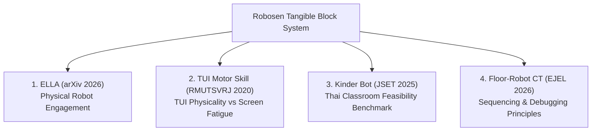

# สรุปเอกสารงานวิจัยที่เกี่ยวข้อง (AS01: Related Research Summary)
> **โครงการ:** Tangible Modular Coding Block System for Robosen Robot  
> **กลุ่มเป้าหมาย:** เด็กปฐมวัยถึงประถมศึกษาตอนต้น (อายุ $\le 7$ ปี)  
> **วัตถุประสงค์:** เอกสารสรุปงานวิจัยเพื่อใช้ประกอบการนำเสนอ (Presentation) ต่ออาจารย์ที่ปรึกษา  
> **วันที่จัดทำ:** 24 สิงหาคม 2026  

---

## 1. ภาพรวมเชิงกลยุทธ์ (Executive Overview)

งานวิจัยทั้ง 4 เรื่องนี้ถูกคัดสรรมาเพื่อสร้างรากฐานทางทฤษฎีและวิชาการที่แข็งแกร่งให้กับโครงการ โดยครอบคลุม 4 มิติหลัก:

1. **การมีปฏิสัมพันธ์กับหุ่นยนต์กายภาพ (Embodied Physical Robotics):** ดึงดูดความสนใจและสร้างการมีส่วนร่วมสูงกว่าสื่อดิจิทัลบนจอ
2. **อินเทอร์เฟซแบบจับต้องได้ (Tangible User Interface - TUI):** พัฒนาทักษะการเคลื่อนไหว ลดความล้าจากหน้าจอ และช่วยให้เด็กเข้าใจนามธรรมได้ดีขึ้น
3. **ความเป็นไปได้ในบริบทการศึกษาไทย (Local Feasibility & Benchmark):** ยืนยันการตอบรับและความพร้อมของห้องเรียนปฐมวัยในประเทศไทย
4. **ทฤษฎีการสอนการคิดเชิงคำนวณ (Computational Thinking Pedagogy):** หลักการออกแบบสื่อการเรียนรู้แบบไร้หน้าจอ (Screenless) และวงจรการดีบั๊กเชิงกายภาพ

---

## 2. สรุปรายละเอียดงานวิจัย 4 เรื่อง (Research Summaries)

### งานวิจัยที่ 1: ELLA — Generative AI-Powered Social Robots for Early Language Development at Home
* **แหล่งอ้างอิง:** [arXiv:2603.12508](https://arxiv.org/html/2603.12508v1) *(นำเสนอในงานประชุมวิชาการ The 25th Interaction Design and Children Conference: ACM IDC 2026)*
* **คณะผู้วิจัย:** Victor Nikhil Antony, Shiye Cao, Shuning Wang, Chien-Ming Huang (Johns Hopkins University)

#### สาระสำคัญและระเบียบวิธีวิจัย:
* **กลุ่มตัวอย่าง:** ทดสอบใช้งานจริงในบ้าน (In-home deployment) กับเด็กอายุ 4–6 ปี จำนวน 10 ครอบครัว เป็นเวลา 8 วัน ร่วมกับการจัด In-home Design Workshops 12 ครั้ง และสัมภาษณ์ผู้ปกครอง 7 คน ครู 5 คน
* **ระบบที่พัฒนา:** หุ่นยนต์โซเชียล 'ELLA' ซึ่งใช้ Generative AI (LLM) สร้างนิทานและการสนทนาแบบ Scaffolded Dialogue เฉพาะบุคคลตามความสนใจของเด็ก เพื่อส่งเสริมการเรียนรู้คำศัพท์วันละ 4 คำ

#### ผลลัพธ์สำคัญ (Key Findings):
1. **ความสนใจสูงมาก:** เด็ก 8 จาก 9 คนระบุว่าชอบและสนุกกับการมีปฏิสัมพันธ์กับหุ่นยนต์กายภาพอย่างต่อเนื่อง
2. **การพัฒนาภาษา:** เด็กสามารถจดจำและเข้าใจคำศัพท์เป้าหมายเฉลี่ยเพิ่มขึ้น 2.8 คำ และมีแนวโน้มพูดตอบโต้เป็นประโยคที่สมบูรณ์และยาวขึ้น
3. **ข้อจำกัดในสภาพแวดล้อมจริง:** พบปัญหาความหน่วงในการประมวลผลเสียง (Latency) และเสียงรบกวนในบ้าน

#### การเชื่อมโยงและประยุกต์ใช้กับโครงการ:
* ยืนยันว่า **หุ่นยนต์ฮาร์ดแวร์จริง (Physical Embodiment) มีอิทธิพลต่อแรงจูงใจและการมีส่วนร่วมของเด็กปฐมวัยสูงกว่าแอปพลิเคชันบนจออย่างชัดเจน**
* *จุดต่อยอด:* โครงการของเราเปลี่ยนเป้าหมายจากการสร้างบทสนทนาด้วย LLM มาเป็น **การควบคุมหุ่นยนต์ฮิวมานอยด์จริง (Robosen K1) ผ่านบล็อกคำสั่ง เพื่อฝึกกระบวนการคิดเชิงตรรกะและวิทยาการคำนวณ**

---

### งานวิจัยที่ 2: การประเมินประสิทธิภาพของการฝึกทักษะกล้ามเนื้อมัดเล็กโดยการใช้ส่วนเชื่อมต่อประสานแบบจับต้องได้ผ่านเกมคอมพิวเตอร์สำหรับเด็กพิการ ผู้มีความบกพร่องทางสติปัญญา
* **แหล่งอ้างอิง:** [วารสารวิจัย มหาวิทยาลัยเทคโนโลยีราชมงคลศรีวิชัย (Recent Science and Technology)](https://li01.tci-thaijo.org/index.php/rmutsvrj/article/view/247662) Vol. 12 No. 3 (2020), หน้า 433–446
* **คณะผู้วิจัย:** วรรณพร ตีเค็ง, กรัณยา สิทธิสงวน, พรคิด อึ้งขาว (มทร.ล้านนา, ม.ศิลปากร, มทร.พระนคร)

#### สาระสำคัญและระเบียบวิธีวิจัย:
* **กลุ่มตัวอย่าง:** การทดลองเปรียบเทียบในเด็กที่มีภาวะบกพร่องทางสติปัญญาจำนวน 60 คน
* **กระบวนการทดลอง:** เปรียบเทียบผลระหว่างกลุ่มที่ฝึกผ่านระบบเชื่อมต่อประสานแบบจับต้องได้ (Tangible User Interface: TUI) กับกลุ่มควบคุมที่ฝึกแบบดั้งเดิมกับนักกิจกรรมบำบัด โดยวัดผลผ่านคะแนนแรงบีบมือ (Hand Force's Scores) และความร่วมมือในกิจกรรม

#### ผลลัพธ์สำคัญ (Key Findings):
1. **พัฒนาการดีขึ้นชัดเจน:** กลุ่มที่ฝึกฝนด้วยอุปกรณ์จับต้องได้ (TUI) มีพัฒนาการของแรงบีบมือและกล้ามเนื้อมัดเล็กสูงกว่ากลุ่มฝึกแบบเดิมอย่างมีนัยสำคัญทางสถิติที่ระดับ $.05$
2. **แรงจูงใจและความร่วมมือ:** ระบบสัมผัส TUI ช่วยกระตุ้นความสนใจ ลดปัญหาการไม่ให้ความร่วมมือหรือเบื่อหน่ายจากการทำกิจกรรมซ้ำๆ ได้อย่างมีประสิทธิภาพ

#### การเชื่อมโยงและประยุกต์ใช้กับโครงการ:
* เป็นหลักฐานเชิงประจักษ์สนับสนุนว่า **การใช้วัตถุกายภาพ (Physical Tangible Blocks) มีความเหนือกว่าการสัมผัสหน้าจอ 2D** ในด้านการกระตุ้นประสาทสัมผัส การประสานงานของมือและสายตา (Hand-Eye Coordination)
* สอดคล้องกับแนวคิดการออกแบบ **บล็อกแม่เหล็ก (Magnetic Snap Blocks)** ของเราที่ช่วยให้เด็กได้ใช้มือหยิบจับ ต่อเรียง และหมุนปรับค่าพารามิเตอร์จริง

---

### งานวิจัยที่ 3: หุ่นยนต์สื่อการเรียนรู้ปฐมวัย: กรณีศึกษา โรงเรียนเทศบาล 4 ฉลองรัตน (Kinder Bot)
* **แหล่งอ้างอิง:** [วารสารวิทยาศาสตร์ วิศวกรรมศาสตร์ และเทคโนโลยี (JSET)](https://ph02.tci-thaijo.org/index.php/JSET/article/view/258777) Vol. 5 No. 2 (2025), หน้า 103–118
* **คณะผู้วิจัย:** สุทธิพงษ์ พันภักดี, ธนมวรรณ นาจะรวย, สาธิต กระเวนกิจ, จักรชัย โสอินทร์ (มหาวิทยาลัยราชภัฏเลย)

#### สาระสำคัญและระเบียบวิธีวิจัย:
* **กลุ่มตัวอย่าง:** นักเรียนระดับชั้นอนุบาล 2 จำนวน 10 คน และครูผู้สอน 3 คน โรงเรียนเทศบาล 4 ฉลองรัตน จังหวัดหนองคาย
* **สถาปัตยกรรมระบบ Kinder Bot:** แบ่งเป็น 3 ส่วน ได้แก่ (1) ระบบควบคุมและสั่งการฮาร์ดแวร์หุ่นยนต์ภายใน, (2) แอปพลิเคชันควบคุมท่าทางแขน/ลำตัวและสื่อการสอน, (3) ระบบเชื่อมต่ออินเทอร์เน็ต/LINE แจ้งเตือนผู้ปกครอง

#### ผลลัพธ์สำคัญ (Key Findings):
1. **ความถูกต้องสมบูรณ์:** การทดสอบฟังก์ชันการทำงาน (การควบคุมแขน, เซนเซอร์หลบหลีก, หน้าจอสัมผัส, ส่งภาพและตารางเรียนผ่าน LINE) มีความถูกต้อง $100\%$
2. **ความพึงพอใจสูงสุด:** ผลประเมินความพึงพอใจของครูและเด็กต่อการใช้งาน Kinder Bot อยู่ในระดับ **"มากที่สุด"**

#### การเชื่อมโยงและประยุกต์ใช้กับโครงการ:
* พิสูจน์ให้เห็นถึง **ความพร้อมและการยอมรับนวัตกรรมหุ่นยนต์ช่วยสอนในบริบทโรงเรียนปฐมวัยของประเทศไทย**
* *จุดเด่นที่โครงการของเราพัฒนาให้เหนือกว่า:* Kinder Bot ยังต้องควบคุมผ่านหน้าจอแท็บเล็ตและเชื่อมต่อคลาวด์/อินเทอร์เน็ต แต่โครงการของเราออกแบบเป็น **ระบบปิดไร้หน้าจอ (100% Screenless via Bluetooth BLE)** ป้องกันปัญหาเด็กติดจอ ใช้งานได้ทันทีแบบ Plug-and-Play โดยไม่ต้องพึ่งเครือข่ายอินเทอร์เน็ต

---

### งานวิจัยที่ 4: Early Childhood Computational Thinking through Tangible Floor-Robot Programming in an eTwinning Community of Practice
* **แหล่งอ้างอิง:** [Electronic Journal of e-Learning (EJEL)](https://academic-publishing.org/index.php/ejel/article/view/4601) Vol. 24 No. 3 (2026), หน้า 92–105 (DOI: `10.34190/ejel.24.3.4601`)
* **คณะผู้วิจัย:** Paraskevi Foti & Tharrenos Bratitsis (University of Western Macedonia, Greece)

#### สาระสำคัญและระเบียบวิธีวิจัย:
* **กลุ่มตัวอย่าง:** ครูปฐมวัยจำนวน 473 คน ผ่านโครงการอบรมและทดลองสอนเด็กอายุ 4–6 ปี ตลอดระยะเวลา 24 สัปดาห์บนแพลตฟอร์ม eTwinning / Moodle
* **รูปแบบการวิจัย:** การวิจัยเชิงออกแบบ (Design-Based Research: DBR) โดยให้เด็กทำกิจกรรมเขียนโปรแกรมหุ่นยนต์บนพื้นแบบไร้หน้าจอ (เช่น หุ่นยนต์ Bee-Bot) ร่วมกับการสังเกตพฤติกรรมและการจัด Focus Groups

#### ผลลัพธ์สำคัญ (Key Findings):
1. **การมีส่วนร่วมสูง:** เด็กทั้งชายและหญิงมีส่วนร่วมในระดับสูง โดยเด็กหญิงแสดงความโดดเด่นในทักษะการทำงานอิสระ การเรียงลำดับขั้นตอน (Sequencing) และการออกแบบอัลกอริทึมอย่างง่าย
2. **3 ปัจจัยหลักในการออกแบบการเรียนรู้ตรรกะคอมพิวเตอร์ (3 Key Design Principles):**
   * **Explicit Sequencing Supports:** ต้องมีสื่อ/อุปกรณ์กายภาพที่ช่วยให้เด็กเห็นลำดับขั้นตอนคำสั่งอย่างชัดเจน
   * **Structured Testing & Debugging Cycles:** ต้องมีวงจรการทดสอบรันคำสั่งและขั้นตอนการแก้ไขข้อผิดพลาด (Debug) ที่เป็นระบบและเข้าใจง่าย
   * **Cooperative Roles:** การกำหนดบทบาทร่วมกันในการทำกิจกรรมกลุ่ม

#### การเชื่อมโยงและประยุกต์ใช้กับโครงการ (สำคัญที่สุด):
* **สถาปัตยกรรมฮาร์ดแวร์ของโครงการ Robosen Block ถูกออกแบบตรงตาม 3 ปัจจัยนี้ทุกประการ:**
  1. *Explicit Sequencing Supports* $\rightarrow$ **บล็อกแม่เหล็กกายภาพ (Modular Snap Blocks)** ที่ต่อเรียงกันในแนวเส้นตรงจากซ้ายไปขวา ทำให้เด็กเห็นลำดับขั้นตอนที่จับต้องได้จริง
  2. *Testing & Debugging Cycles* $\rightarrow$ **ระบบแสดงผลไฟ LED สีเขียวกระพริบตามบล็อกที่กำลังเคลื่อนไหว (Active Step Tracking)** ร่วมกับปุ่ม Start บน Master Block ช่วยให้เด็กสังเกตเห็นทันทีว่าหุ่นยนต์ผิดพลาดที่บล็อกใด แล้วสามารถหยิบสลับหรือเปลี่ยนบล็อกเพื่อดีบั๊กได้ทันที

---

## 3. ตารางสรุปเปรียบเทียบเชิงวิชาการ (Academic Comparison Matrix)

| งานวิจัย | กลุ่มประชากร | เทคโนโลยี/อุปกรณ์ | ประเด็นสำคัญที่นำมาสนับสนุนโครงการ Robosen Block |
| :--- | :---: | :---: | :--- |
| **1. ELLA (2026)** | เด็กอายุ 4–6 ปี (10 ครอบครัว) | Social Robot + LLM Cloud | หุ่นยนต์ฮาร์ดแวร์จริงสร้างการมีส่วนร่วมและแรงจูงใจสูงกว่าสื่อ 2D ดิจิทัล |
| **2. TUI Fine Motor (2020)** | เด็กพิเศษ 60 คน | Tangible Interface (TUI) | การหยิบจับวัตถุกายภาพจริงช่วยพัฒนาทักษะกล้ามเนื้อและลดความเบื่อหน่ายจากหน้าจอ |
| **3. Kinder Bot (2025)** | เด็ก อ.2 (10 คน) + ครู (3 คน) | Educational Robot + App + LINE | ยืนยันความพร้อมของโรงเรียนไทย และเป็น Benchmark ในการพัฒนาระบบ Screenless BLE |
| **4. Floor-Robot CT (2026)** | ครูปฐมวัย 473 คน (เด็ก 4–6 ปี) | Floor Robot (Bee-Bot) | สนับสนุนการออกแบบ *Explicit Sequencing Blocks* และ *Active LED Debugging Cycles* |
