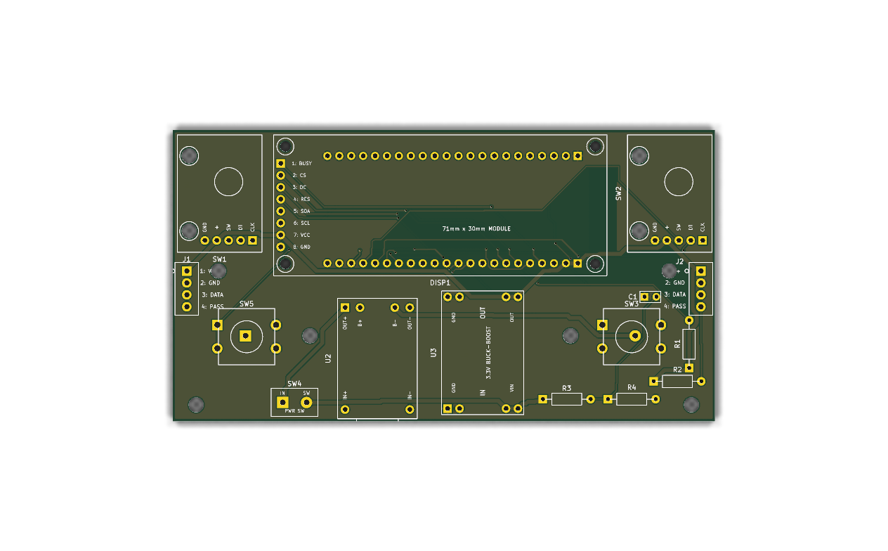
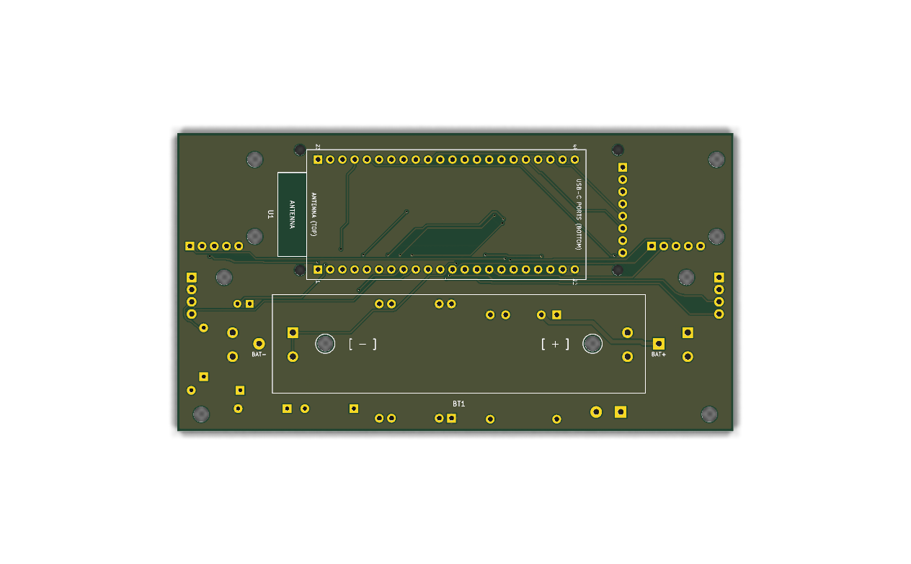

# Robosen Master Block — PCB Mounting Holes & 3D Casing Specification

## 1. PCB Board Outline Summary
- **Bounding Box (`Edge.Cuts`)**: 
  - Top-Left: `(86.50, 62.00) mm`
  - Bottom-Right: `(202.00, 124.00) mm`
  - Overall Dimensions: **115.50 mm × 62.00 mm**
  - Centerline: **X = 144.25 mm**

---

## 2. Mounting Hole Coordinates (KiCad PCB)
Official KiCad footprint `MountingHole:MountingHole_3.2mm_M3` (Drill: Ø3.20 mm, Courtyard: Ø6.40 mm, Locked: `true`).

| Hole ID | Function / Location | X (mm) | Y (mm) | Distance to Centerline | Edge Clearance |
| :--- | :--- | :---: | :---: | :---: | :---: |
| **`H1`** | Upper-Left (below Knob 1, beside Config Port `J1`) | **96.25** | **92.00** | 48.00 mm (Left) | 9.75 mm from left edge |
| **`H2`** | Upper-Right (below Knob 2, beside Run Port `J2`) | **192.25** | **92.00** | 48.00 mm (Right) | 9.75 mm from right edge |
| **`H3`** | Lower-Left Corner (below Stop Button `SW5`) | **91.50** | **120.50** | 52.75 mm (Left) | 5.00 mm from left, 3.50 mm from bottom |
| **`H4`** | Lower-Right Corner (below Start Button `SW3`) | **197.00** | **120.50** | 52.75 mm (Right) | 5.00 mm from right, 3.50 mm from bottom |

### Relative Hole-to-Hole Dimensions for CAD / Enclosure
- **Top Row Span (`H1` to `H2`)**: **96.00 mm**
- **Bottom Row Span (`H3` to `H4`)**: **105.50 mm**
- **Vertical Span (`H1/H2` to `H3/H4`)**: **28.50 mm**
- **Diagonal Span (`H1` to `H4`)**: **104.72 mm**
- **Diagonal Span (`H2` to `H3`)**: **104.72 mm**

---

## 3. Recommended 3D Printed Casing Boss Dimensions (M3 Brass Heat-Set Inserts)
For standard M3 brass heat-set threaded inserts (e.g., Ruthex, Voron, or generic M3 × 4 mm / M3 × 5.7 mm inserts):

- **Heat-Set Insert Outer Diameter (OD)**: Ø4.6 mm typical
- **Standoff Boss Outer Diameter**: **Ø6.5 mm to 7.0 mm** (provides ≥ 1.2 mm radial wall thickness for strength)
- **Insert Pilot Hole Diameter**: **Ø4.0 mm to 4.2 mm** (with 0.5 mm × 45° lead-in chamfer for alignment during iron insertion)
- **Pilot Hole Depth**: **≥ 5.5 mm** (leaves clearance below insert for molten plastic capture and screw tip)
- **Fasteners**: M3 Socket Head or Button Head Cap Screws ($L = 5\text{ mm}$ or $6\text{ mm}$, head diameter ≤ 5.7 mm)
- **Fastener Insulation Recommendation**: Use non-conductive nylon washers or nylon screws/standoffs to ensure zero possibility of abrasion against the PCB surface solder mask.

---

## 4. Crucial Assembly & Mechanical Guidelines

### 4.1. 18650 Battery Holder (`BT1`) Underside Clearance
- **Pin Stacking**: There are **12 through-hole pin centers** directly beneath the plastic body of the 18650 holder (`U2` pads 1–4, `U3` pads 5–8, `SW3` pad 1 legs, `SW5` pad 2 legs).
- **Assembly Requirement**:
  1. Clip all through-hole leads on the back side completely flush using sharp flush cutters.
  2. Apply a **$1.0\text{ mm} - 1.5\text{ mm}$ thick EVA foam tape** or double-sided mounting foam pad beneath the battery holder body. This absorbs the height of the rounded solder joints and prevents pressure against the battery cell or plastic holder.

### 4.2. E-Paper Display (`DISP1`) vs. ESP32-S3 Antenna
- The front e-paper display module physically overlaps approximately 65% of the ESP32 antenna area on the opposite side.
- The PCB copper strictly avoids the antenna keepout area ($0.00\text{ mm}^2$ copper fill).
- **Prototype Testing**: Ensure you test Bluetooth Low Energy (BLE) connection range through your assembled 3D casing to verify wireless performance meets your project requirements.

---

## 5. PCB Fabrication Specifications (For Manufacturer)

- **Layers**: 2 Layers
- **Dimensions**: $115.50\text{ mm} \times 62.00\text{ mm}$
- **Material**: FR-4 Standard ($T_g \ge 130^\circ\text{C}$)
- **Board Thickness**: $1.6\text{ mm}$
- **Copper Weight**: $1\text{ oz}$ ($35\ \mu\text{m}$)
- **Solder Mask**: Matte Green or Matte Black
- **Silkscreen**: White
- **Surface Finish**: Lead-Free HASL or ENIG (Electroless Nickel Immersion Gold)
- **Minimum Trace / Clearance**: $0.25\text{ mm} / 0.22\text{ mm}$ (Power traces: $0.80\text{ mm}$)
- **Minimum Drill / Via**: $0.3\text{ mm}$ drill / $0.6\text{ mm}$ diameter
- **Production Package**: [`hardware/master_block/robosen_master_block_gerbers.zip`](../hardware/master_block/robosen_master_block_gerbers.zip) (**ORDERED AT JLCPCB**)

---

## 6. Visual Layout Previews
- **Front Side (Modules, Buttons, Knobs, Display)**:
  

- **Back Side (ESP32-S3 Socket, 18650 Battery Holder)**:
  

