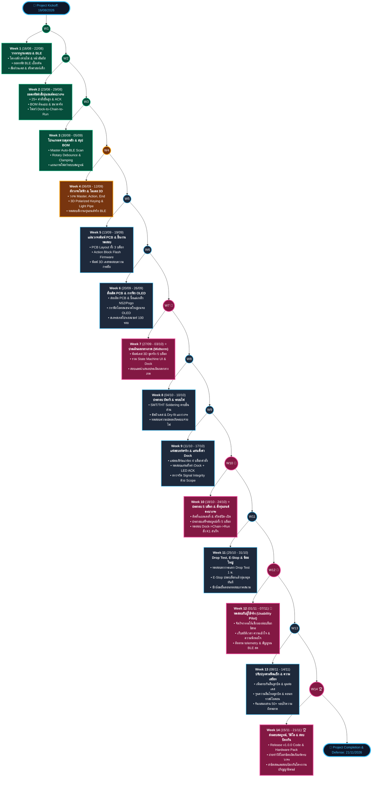

# Robosen Block Project — 14-Week Master Timeline Infographic

> **Project Focus**: Physical Modular Programming Blocks for Robosen K1 Robot  
> **Source Plan**: [14 Weeks Plan Google Spreadsheet](https://docs.google.com/spreadsheets/u/1/d/1kW47Z_EtlDmrVkeLjoNJkVM2ukwHJniR2-91o9h_9HM/htmlview)  
> **Format**: Single-Line Central Spine with Weekly Deliverable Branches (Strictly task & deliverable focused, excluding individual member assignments)  

---

## 1. Visual Flowchart / Diagram (Mermaid)

---

## 2. Week-by-Week Executive Deliverables Breakdown

| สัปดาห์ (Week) | ช่วงวันที่ (Date Range) | สถานะ (Status) | เป้าหมายหลัก (Weekly Focus) | ผลงาน & กิจกรรมสำคัญ (Deliverables) |
| :--- | :--- | :--- | :--- | :--- |
| **WEEK 01** | `16/08/2026 - 22/08/2026` | `เสร็จสิ้น (DONE)` | **วางรากฐานระบบ, โครงสร้างบล็อกคำสั่ง & เชื่อมต่อบลูทูธเบื้องต้น** *System Foundation, Modular Architecture & Baseline BLE Protocol* | • <b>[ฮาร์ดแวร์ & วงจร]</b> ร่างโครงสร้างระบบจ่ายไฟ & กำหนดสัญญาณหน้าสัมผัสเชื่อมต่อระหว่างบล็อก • <b>[โครงสร้าง & 3D]</b> กำหนดขนาดและสัดส่วนตัวบล็อกให้จับถือถนัดมือ & วางตำแหน่งจุดเชื่อมต่อ • <b>[เฟิร์มแวร์ & โปรโตคอล]</b> ถอดรหัสคำสั่งบลูทูธเบื้องต้นของหุ่นยนต์ K1 (เดินหน้า ถอยหลัง หันเลี้ยว) • <b>[การออกแบบ & สรีรศาสตร์]</b> ศึกษาหลักสรีรศาสตร์ในการจับถือ: ความโค้งมนที่ปลอดภัย และการใช้สี/รูปทรง • <b>[ความปลอดภัย & มาตรฐาน]</b> กำหนดเกณฑ์ความปลอดภัย: แรงยึดแม่เหล็ก, ระบบกันไฟลัดวงจร & ความทนต่อการตก |
| **WEEK 02** | `23/08/2026 - 29/08/2026` | `เสร็จสิ้น (DONE)` | **ถอดรหัสคำสั่งหุ่นยนต์ครบวงจร, สร้างโปรแกรมสื่อสาร & ระบบจำลองการทำงาน** *Advanced Protocol Decoding, Control Engine & Logic Simulation* | • <b>[ฮาร์ดแวร์ & วงจร]</b> วิเคราะห์ฮาร์ดแวร์หุ่นยนต์, วงจรชาร์จไฟ & จัดเตรียมชุดไฟล์เสียงสำหรับคำสั่ง • <b>[โครงสร้าง & 3D]</b> สรุปรายการชิ้นส่วนต้นแบบ & วัดขนาดจริงของแผงวงจรเพื่อเตรียมออกแบบเคส • <b>[เฟิร์มแวร์ & โปรโตคอล]</b> ถอดรหัสคำสั่งขั้นสูงกว่า 25 รูปแบบ, ระบบตอบกลับ (ACK) & โปรแกรมควบคุมการเคลื่อนไหว • <b>[การออกแบบ & สรีรศาสตร์]</b> วางลำดับขั้นตอนการใช้งาน: เสียบตั้งค่าแท่น -> ต่อเรียงบล็อกแม่เหล็ก -> ไฟบอกสถานะ • <b>[การทดสอบ & QA]</b> พัฒนาระบบจำลองการสื่อสารเพื่อทดสอบการรับส่งข้อมูลและความถูกต้องของคำสั่ง |
| **WEEK 03** | `30/08/2026 - 05/09/2026` | `เสร็จสิ้น (DONE)` | **พัฒนาโครงสร้างโปรแกรมควบคุมหลัก & สรุปรายการอุปกรณ์ฮาร์ดแวร์** *Master Controller Core Engine & Final Hardware BOM* | • <b>[ฮาร์ดแวร์ & วงจร]</b> สรุปรายการอุปกรณ์หลัก (BOM): ไมโครคอนโทรลเลอร์, ไฟสถานะ, จอภาพ, ปุ่มปรับค่า & แบตเตอรี่ • <b>[โครงสร้าง & 3D]</b> ร่างแบบโครงสร้างยึดอุปกรณ์สำหรับชุดทดลองต้นแบบ & วางตำแหน่งพอร์ตเชื่อมต่อ • <b>[เฟิร์มแวร์ & โปรโตคอล]</b> พัฒนาโปรแกรมหลักบน Master Block: ค้นหาและเชื่อมต่อหุ่นยนต์อัตโนมัติ พร้อมระบบความปลอดภัย • <b>[การออกแบบ & สรีรศาสตร์]</b> จัดทำแผนภาพสรุปโฟลว์ขั้นตอนการทำงานและการส่งผ่านคำสั่งของระบบบล็อก • <b>[การทดสอบ & QA]</b> ทดสอบความแม่นยำของปุ่มหมุนปรับค่า พร้อมระบบตัดสัญญาณรบกวนและจำกัดขอบเขตค่า |
| **WEEK 04** | `06/09/2026 - 12/09/2026` | `กำลังดำเนินการ (IN PROGRESS)` | **ออกแบบแผนผังวงจรไฟฟ้าครบชุด & ขึ้นโมเดลสามมิติตัวบล็อกคำสั่ง** *Complete Electrical Schematics & 3D Enclosure CAD Modeling* | • <b>[ฮาร์ดแวร์ & วงจร]</b> ออกแบบวงจรไฟฟ้าครบ 3 ส่วน: Master Block, Action Block และ End Block • <b>[โครงสร้าง & 3D]</b> ออกแบบโมเดล 3D: แม่เหล็กป้องกันต่อกลับด้าน, ท่อนำแสงไฟแสดงผล & เคสบล็อกหลัก • <b>[เฟิร์มแวร์ & โปรโตคอล]</b> ทดสอบเชื่อมต่อบล็อกจำลองเข้ากับหุ่นยนต์จริง เพื่อยืนยันการส่งคำสั่งไร้สายผ่าน BLE • <b>[การออกแบบ & สรีรศาสตร์]</b> ออกแบบกราฟิกบนตัวบล็อกและหน้าจอ: ไอคอนคำสั่งอ่านง่าย, แถบสีแบ่งหมวด & ลูกศรทิศทาง • <b>[การทดสอบ & QA]</b> ตรวจสอบความปลอดภัยทางไฟฟ้าและวงจรควบคุมการชาร์จแบตเตอรี่บนชุดทดลอง |
| **WEEK 05** | `13/09/2026 - 19/09/2026` | `ตามแผนงาน (SCHEDULED)` | **ออกแบบแผ่นวงจรพิมพ์ (PCB), พัฒนาโปรแกรมประจำบล็อก & พิมพ์ชิ้นงานสามมิติทดสอบ** *PCB Routing, Action Block Firmware & 3D Test Print Fit Checks* | • <b>[ฮาร์ดแวร์ & วงจร]</b> ออกแบบลายวงจรแผ่น PCB ให้มีขนาดกะทัดรัดและลงตัวกับโครงสร้างบล็อกทั้ง 3 รูปแบบ • <b>[โครงสร้าง & 3D]</b> พิมพ์ชิ้นงาน 3D ทดสอบ: ตรวจสอบความกระชับของชิ้นส่วน, แรงดูดแม่เหล็ก & การมองเห็นแสงไฟ • <b>[เฟิร์มแวร์ & โปรโตคอล]</b> พัฒนาโปรแกรมประจำ Action Block: บันทึกค่าลงหน่วยความจำ, ควบคุมไฟสถานะ & ประมวลผล • <b>[การออกแบบ & สรีรศาสตร์]</b> ออกแบบสัญลักษณ์บนบล็อก: เครื่องหมายจุดต่อ, สเกลรอบปุ่มหมุน & สัญลักษณ์ปิดท้าย • <b>[การทดสอบ & QA]</b> รันชุดทดสอบการสื่อสารอัตโนมัติ: รับมือกรณีต่อบล็อกไม่แน่น & ตรวจความถูกต้องข้อมูล |
| **WEEK 06** | `20/09/2026 - 26/09/2026` | `ตามแผนงาน (SCHEDULED)` | **สั่งผลิตแผ่นวงจรและจัดซื้ออุปกรณ์ & พัฒนากราฟิกหน้าจอแสดงผล** *PCB Manufacturing Dispatch, Parts Procurement & OLED UI Graphics* | • <b>[ฮาร์ดแวร์ & วงจร]</b> ตรวจสอบความถูกต้องของแบบวงจร & ส่งสั่งผลิตแผ่นวงจรพิมพ์ (PCB) และสั่งซื้อชิ้นส่วน • <b>[โครงสร้าง & 3D]</b> จัดซื้อชิ้นส่วนโครงสร้าง: แม่เหล็กแรงสูง N52, ขั้วพินสปริง (Pogo), ปุ่มหมุน, สวิตช์ & แบตเตอรี่ • <b>[เฟิร์มแวร์ & โปรโตคอล]</b> พัฒนาระบบแสดงผล OLED: ไอคอนคำสั่งขนาดใหญ่ชัดเจน, ขีดแถบพารามิเตอร์ & สัญญาณบลูทูธ • <b>[การออกแบบ & สรีรศาสตร์]</b> ผลิตตัวอย่างสติกเกอร์สัญลักษณ์: ตรวจสอบความคมชัด ความทนทานต่อการขูดขีด & แสงไฟ • <b>[การทดสอบ & QA]</b> ทดสอบความเสถียรของหน่วยประมวลผล: รันประมวลผลคำสั่งต่อเนื่องกว่า 100 รอบโดยไม่สะดุด |
| **WEEK 07 🌟** | `27/09/2026 - 03/10/2026` | `ตามแผนงาน (SCHEDULED)` | **🎯 ประเมินผลกลางภาค (Midterm), สั่งพิมพ์เคสบล็อกชุดจริง & เตรียมอุปกรณ์ประกอบ** *Midterm Progress Evaluation, Production 3D Cases & Assembly Preparation* | • <b>[ฮาร์ดแวร์ & วงจร]</b> จัดเตรียมเครื่องมือ อุปกรณ์บัดกรี และโต๊ะปฏิบัติการสำหรับประกอบบอร์ดอิเล็กทรอนิกส์ • <b>[โครงสร้าง & 3D]</b> พิมพ์ชิ้นงาน 3D เคสชุดจริงความแข็งแรงสูงครบเซต: บล็อกหลัก 1 + บล็อกคำสั่ง 3 + บล็อกปิดท้าย 1 • <b>[เฟิร์มแวร์ & โปรโตคอล]</b> เชื่อมโยงระบบแสดงผลกับระบบควบคุม: สลับหน้าจอเมนู, โหมดตั้งค่าบล็อก & โหมดเชื่อมต่อหุ่นยนต์ • <b>[การออกแบบ & สรีรศาสตร์]</b> ประเมินความสะดวกในการใช้งาน: ขอบมุมโค้งมนไม่บาดมือ, ความหนืดของลูกบิด & ความชัดของจอ • <b>[หมุดหมายสำคัญ]</b> 【ประเมินผลกลางภาค】: ส่งรายงานความก้าวหน้าโครงการ, นำเสนอผลงาน & สอบประเมินกลางภาค |
| **WEEK 08** | `04/10/2026 - 10/10/2026` | `ตามแผนงาน (SCHEDULED)` | **ประกอบและบัดกรีแผ่นวงจร & ทดสอบความปลอดภัยระบบจ่ายไฟ** *PCB Assembly & Soldering, Power Safety & Bring-up Verification* | • <b>[ฮาร์ดแวร์ & วงจร]</b> ประกอบบัดกรีชิ้นส่วนอิเล็กทรอนิกส์, ขั้วสัมผัสเชื่อมต่อ, ปุ่มปรับค่า & หน้าจอแสดงผล • <b>[โครงสร้าง & 3D]</b> ขัดเก็บผิวสัมผัสเคส 3D ให้เรียบเนียน & ทดลองติดตั้งแผงวงจรจริงลงในตัวบล็อก (Dry Fit) • <b>[เฟิร์มแวร์ & โปรโตคอล]</b> ติดตั้งโปรแกรมทดสอบลงบล็อกหลัก: ตรวจสอบการทำงานของจอแสดงผลและปุ่มหมุนปรับค่า • <b>[การออกแบบ & สรีรศาสตร์]</b> จัดทำสติกเกอร์สัญลักษณ์คำสั่งเคลือบผิวทนทานพิเศษ พร้อมติดตั้งลงบนเคสบล็อกจริง • <b>[การทดสอบ & QA]</b> ทดสอบความปลอดภัยทางไฟฟ้า: วัดแรงดันไฟเลี้ยง, ระบบชาร์จตัดไฟ & กระแสไฟสแตนด์บาย |
| **WEEK 09** | `11/10/2026 - 17/10/2026` | `ตามแผนงาน (SCHEDULED)` | **ติดตั้งโปรแกรมลงบอร์ดจริง, ทดสอบแท่นตั้งค่าบล็อก & ตรวจสอบการสื่อสารข้อมูล** *Firmware Flashing, Configuration Dock Integration & Signal Integrity* | • <b>[ฮาร์ดแวร์ & วงจร]</b> ตรวจสอบความสมบูรณ์ของลายวงจร & วัดระดับความเรียบเสมอกันของขั้วพินสปริงหน้าสัมผัส • <b>[โครงสร้าง & 3D]</b> ติดตั้งแม่เหล็กเข้ากับเคสบล็อกตามแนวขั้วที่กำหนด ดูดประกบแน่นหนาและต่อถูกด้านเสมอ • <b>[เฟิร์มแวร์ & โปรโตคอล]</b> ติดตั้งโปรแกรมลง Action Block ทั้ง 4 ชิ้น & ทดสอบตั้งค่าพารามิเตอร์ผ่าน Dock พร้อมไฟตอบรับ • <b>[การออกแบบ & สรีรศาสตร์]</b> จัดทำแบบประเมินความสะดวกการใช้งาน: แรงดูดแม่เหล็ก, ความง่ายในการต่อ & การเข้าใจไฟสถานะ • <b>[การทดสอบ & QA]</b> ตรวจวัดสัญญาณข้อมูลด้วย Oscilloscope พร้อมทดสอบการขยับ/โยกบล็อกขณะส่งข้อมูล |
| **WEEK 10 🌟** | `18/10/2026 - 24/10/2026` | `ตามแผนงาน (SCHEDULED)` | **🤖 ประกอบตัวบล็อกสมบูรณ์ครบชุด & ทดสอบการทำงานร่วมกับหุ่นยนต์ครบวงจร** *Full 5-Block Integration & End-to-End Execution with K1 Robot* | • <b>[ฮาร์ดแวร์ & วงจร]</b> ติดตั้งชุดแบตเตอรี่และสวิตช์เปิด-ปิดเข้ากับ Master Block พร้อมระบบป้องกันไฟ • <b>[โครงสร้าง & 3D]</b> ประกอบวงจร, จอภาพ, ปุ่มหมุน, ปุ่มกด และช่องไฟเข้าเคสตัวบล็อกสมบูรณ์ครบทั้ง 5 บล็อก • <b>[เฟิร์มแวร์ & โปรโตคอล]</b> ทดสอบครบวงจร: ตั้งค่าที่แท่น -> ต่อบล็อกเรียงคำสั่ง -> กด Run -> หุ่นยนต์เคลื่อนไหวสำเร็จ • <b>[การออกแบบ & สรีรศาสตร์]</b> จัดเซตกล่องบล็อกคำสั่งครบ 5 ชิ้น พร้อมจัดทำคู่มือแนะนำการใช้งานเบื้องต้นแบบเข้าใจง่าย • <b>[การทดสอบ & QA]</b> ตรวจสอบไฟแสดงผลวิ่งตามจังหวะหุ่นยนต์ & ยืนยันความแม่นยำในการประมวลผลคำสั่ง 100% |
| **WEEK 11** | `25/10/2026 - 31/10/2026` | `ตามแผนงาน (SCHEDULED)` | **ทดสอบความแข็งแรงทนทาน, ระบบหยุดทำงานฉุกเฉิน & ซ้อมใหญ่การทำงาน** *Drop Durability Testing, Emergency Disconnect Failsafe & Rehearsal* | • <b>[ฮาร์ดแวร์ & วงจร]</b> ตรวจวัดอุณหภูมิความร้อนขณะใช้งานต่อเนื่อง & วัดแรงดันไฟเลี้ยงเมื่อต่อบล็อกยาวสูงสุด • <b>[โครงสร้าง & 3D]</b> ทดสอบการตกกระแทก (Drop Test): ตรวจสอบว่าเคสและขั้วสัมผัสไม่แตกหักเสียหาย • <b>[เฟิร์มแวร์ & โปรโตคอล]</b> ทดสอบความปลอดภัยเมื่อดึงบล็อกออกขณะทำงาน: หุ่นยนต์หยุดทำงานทันทีพร้อมสัญญาณเตือน • <b>[การออกแบบ & สรีรศาสตร์]</b> ตรวจมาตรฐานความปลอดภัย: ทุกเหลี่ยมมุมโค้งมน, วัสดุไร้สารพิษ & แม่เหล็กฝังแน่นไม่หลุด • <b>[การทดสอบ & QA]</b> ซักซ้อมขั้นตอนทดสอบภาคสนามเสมือนจริง: เตรียมอุปกรณ์สำรอง, มุมกล้อง & เกณฑ์ประเมิน |
| **WEEK 12 🌟** | `01/11/2026 - 07/11/2026` | `ตามแผนงาน (SCHEDULED)` | **🌟 ทดสอบการใช้งานระบบบล็อกจริงกับผู้ใช้ในวันหยุดสุดสัปดาห์ (Usability Pilot)** *Weekend Field Pilot & Usability Testing with Real Users* | • <b>[ฮาร์ดแวร์ & วงจร]</b> ดูแลฮาร์ดแวร์ระหว่างการทดสอบ: ติดตามระดับแบตเตอรี่, ตรวจหน้าสัมผัสขั้วบล็อก & อุปกรณ์สำรอง • <b>[โครงสร้าง & 3D]</b> ประเมินการใช้งานจริง: ความง่ายในการต่อ/ถอดบล็อกแม่เหล็ก, ความถนัดในการหมุนลูกบิด & ความทนทาน • <b>[เฟิร์มแวร์ & โปรโตคอล]</b> ติดตามระบบควบคุมและการสื่อสาร: ตรวจสอบความเสถียรในการส่งคำสั่งบลูทูธ & จังหวะไฟสถานะ • <b>[การออกแบบ & สรีรศาสตร์]</b> จัดกิจกรรมทดสอบกับผู้ใช้จริง: ให้ต่อบล็อกสั่งงานหุ่นยนต์อย่างอิสระ & ประเมินความพึงพอใจ • <b>[การทดสอบ & QA]</b> บันทึกข้อมูลเชิงประจักษ์: เวลาที่ใช้ประมวลผล, ความถูกต้องของไฟสถานะ & ปัญหาที่พบเพื่อปรับปรุง |
| **WEEK 13** | `08/11/2026 - 14/11/2026` | `ตามแผนงาน (SCHEDULED)` | **ปรับปรุงตามผลตอบรับของผู้ใช้, ปรับแต่งหน้าจอแสดงผลและระบบ & ทดสอบความเสถียร** *Post-Pilot Feedback Refinements, UI/Firmware Polish & Endurance Testing* | • <b>[ฮาร์ดแวร์ & วงจร]</b> ตรวจสอบสภาพจุดเชื่อมต่อและแบตเตอรี่หลังผ่านการทดสอบหนัก & ปรับปรุงโหมดประหยัดพลังงาน • <b>[โครงสร้าง & 3D]</b> ปรับปรุงเคสตามฟีดแบ็ก: เพิ่มลายกันลื่นที่ลูกบิดหมุน & ปรับมุมลาดเอียงให้ต่อบล็อกได้ง่ายยิ่งขึ้น • <b>[เฟิร์มแวร์ & โปรโตคอล]</b> ปรับแต่งโปรแกรม: ปรับความลื่นไหลของการหมุนค่า, เพิ่มความคมชัดของไอคอน & จังหวะไฟหายใจ • <b>[การออกแบบ & สรีรศาสตร์]</b> วิเคราะห์ผลตอบรับจากผู้ใช้: สรุปคะแนนความสะดวกในการจับถือ, ความเข้าใจคำสั่ง & กราฟสรุป • <b>[การทดสอบ & QA]</b> ทดสอบการทำงานซ้ำแบบผสมผสานต่อเนื่องกว่า 50 รอบ ยืนยันระบบทำงานเสถียรสูงสุดโดยไม่สะดุด |
| **WEEK 14 🌟** | `15/11/2026 - 21/11/2026` | `ตามแผนงาน (SCHEDULED)` | **🏆 ประกอบชุดบล็อกฉบับสมบูรณ์, ถ่ายวิดีโอสาธิต, จัดทำรายงานวิชาการ & สอบป้องกันโครงงาน** *Final Assembly, Demonstration Video, Technical Report & Final Project Defense* | • <b>[ฮาร์ดแวร์ & วงจร]</b> รวบรวมเอกสารวิศวกรรมฮาร์ดแวร์ฉบับสมบูรณ์: ผังวงจร (Schematic), แบบ PCB, BOM & ผลการทดสอบ • <b>[โครงสร้าง & 3D]</b> ตรวจสอบความเรียบร้อยขั้นสุดท้าย: ทำความสะอาดเคส, ติดสติกเกอร์สัญลักษณ์ & บรรจุลงกล่องจัดแสดง • <b>[เฟิร์มแวร์ & โปรโตคอล]</b> จัดเก็บซอร์สโค้ดและโครงสร้างโปรเจกต์เวอร์ชันสมบูรณ์ (Release v1.0.0) พร้อมเอกสารกำกับ • <b>[การออกแบบ & สรีรศาสตร์]</b> จัดทำเล่มรายงานวิชาการฉบับสมบูรณ์: สรุปผลการออกแบบสรีรศาสตร์, รายงานผลการทดสอบ & สไลด์ • <b>[หมุดหมายสำคัญ]</b> 【สอบป้องกันโครงงาน】: ถ่ายทำวิดีโอสาธิตผลิตภัณฑ์ & สมาชิกทุกคนร่วมสาธิตสดในการสอบป้องกันโครงงาน |

---

## 3. Dedicated Deliverable Assets
- **Vector Infographic (SVG)**: [`docs/diagrams/project_timeline_infographic.svg`](file:///C:/Users/nnnn/Projects/robosen_block/docs/diagrams/project_timeline_infographic.svg)
- **Interactive Web Infographic (HTML)**: [`docs/diagrams/project_timeline_infographic.html`](file:///C:/Users/nnnn/Projects/robosen_block/docs/diagrams/project_timeline_infographic.html)
- **Project Plan Document (Markdown)**: [`plans/TIMELINE_INFOGRAPHIC.md`](file:///C:/Users/nnnn/Projects/robosen_block/plans/TIMELINE_INFOGRAPHIC.md)